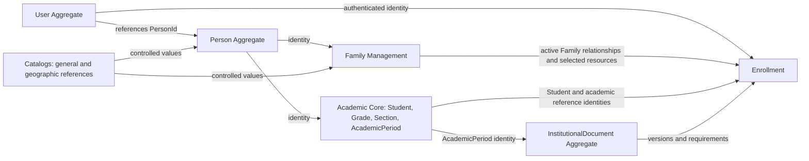

# DOMAIN MODEL

**Versión:** 2.0
**Estado:** Aprobado
**Última actualización:** 2026-07-30

## 1. Propósito

Este documento define el modelo conceptual y táctico de Antares SIS para el MVP, con especial detalle para la matrícula anual. Es la guía de negocio para **ARCHITECTURE**, **DATABASE_DESIGN**, **ERD**, **CATALOGS** y **DECISIONS**: explica responsabilidades, límites y reglas, pero no prescribe su implementación.

El conocimiento histórico del modelo oficial se conserva cuando no contradice el descubrimiento aprobado. **ENROLLMENT_DOMAIN_DISCOVERY** es la fuente canónica de las decisiones de matrícula y prevalece ante una contradicción en ese dominio.

## 2. Objetivos del modelo

- Representar el negocio con fidelidad y lenguaje compartido.
- Mantener independencia tecnológica y separar el dominio de sus mecanismos de entrega y almacenamiento.
- Permitir una solución White Label aislada por institución.
- Reutilizar identidad institucional y recursos familiares sin alterar el historial anual.
- Proteger consistencia conceptual con límites claros de responsabilidad.
- Facilitar la evolución modular mediante Bounded Contexts.
- Separar identidad, acceso, roles institucionales y relaciones familiares.

## 3. Alcance del MVP

El MVP incluye Representative Portal; identidad institucional; acceso de representantes; representantes, estudiantes y familias; recursos de Family; matrícula anual; ubicación académica; BillingInformation declarativa de Enrollment; información médica anual; necesidad de transporte institucional; documentos institucionales; revisión administrativa; Submission, Reopening, Completion y Cancellation.

## 4. Exclusiones

Quedan fuera pagos, cuentas por cobrar, contabilidad, emisión de facturas, portal de estudiantes, operación logística de transporte, calificaciones, asistencia, biblioteca, nómina, recursos humanos y funcionalidades no aprobadas en el discovery. BillingInformation pertenece a Enrollment como declaración anual; el dominio financiero no forma parte de este alcance.

## 5. Principios del modelo

### 5.1 White Label

Cada institución expresa su propia identidad, catálogos, períodos, documentos y reglas autorizadas sin alterar el núcleo conceptual compartido.

### 5.2 Una base de datos por institución

Cada institución es un límite de aislamiento operativo y de datos. La estrategia de una base de datos por institución pertenece a Arquitectura y a ADR-0012; el dominio solo exige aislamiento institucional.

### 5.3 Independencia tecnológica

El modelo describe reglas, conceptos y colaboraciones de negocio. No depende de lenguaje, framework, transporte ni mecanismo de almacenamiento.

### 5.4 Separación entre identidad, acceso, roles y relaciones

Person identifica institucionalmente a un ser humano. Toda cuenta User pertenece exactamente a una Person; una Person puede existir sin User. Student y Representative son roles institucionales estables que referencian una Person. Family expresa relaciones y recursos familiares, no identidad personal.

### 5.5 Propiedad explícita de los datos

Cada dato tiene un propietario conceptual. La identidad estable no se confunde con recursos de Family ni con declaraciones anuales de Enrollment. Una copia histórica solo existe cuando el negocio la necesita para preservar una Submission.

### 5.6 Consistencia mediante Aggregate Roots

Cada Aggregate Root protege sus invariantes y coordina el cambio de sus entidades internas. Las reglas que involucran más de un Aggregate se validan de forma coordinada por un Domain Service.

### 5.7 Referencias entre Aggregates por identidad

Los Aggregates se relacionan por identidad y no comparten entidades mutables. Una referencia permite verificar existencia, pertenencia y autorización sin transferir propiedad de datos.

### 5.8 Reglas de negocio antes que persistencia

Las invariantes y el lenguaje del negocio preceden a cualquier decisión física. La documentación técnica posterior implementará este modelo sin redefinirlo.

### 5.9 Preservación del historial anual

Cada Enrollment conserva su significado histórico sin ser inmutable de forma absoluta: puede pasar de Submitted a Draft mediante Reopening y volver a enviarse. La precarga crea una nueva declaración anual y no modifica matrículas previas. El snapshot preserva los recursos familiares seleccionados en cada Submission vigente.

### 5.10 Autorización validada en servidor

La interfaz puede proponer un contexto, pero nunca autoriza. Toda solicitud valida en servidor la cadena de acceso y la relación activa con Family.

## 6. Lenguaje ubicuo

| Concepto | Significado |
|---|---|
| Person | Identidad institucional única de una persona. |
| User | Cuenta de acceso institucional que pertenece exactamente a una Person; una Person puede existir sin User. |
| Representative | Rol institucional de una Person que participa en una o varias Family. |
| Student | Rol académico estable de una Person. |
| Family | Unidad relacional que administra membresías y recursos familiares. |
| FamilyRepresentative | Membresía histórica de un Representative en una Family. |
| FamilyStudent | Membresía histórica de un Student en una Family. |
| FamilyAddress | Recurso de dirección reutilizable de una Family. |
| RepresentativeAddressAssignment | Selección de una FamilyAddress para un Representative dentro de Family. |
| StudentAddressAssignment | Selección de una FamilyAddress para un Student dentro de Family. |
| FamilyEmergencyContact | Recurso familiar de contacto de emergencia con datos propios; no es Person. |
| EmergencyContactAssignment | Uso de un contacto de emergencia por un Student de la misma Family. |
| FamilyAuthorizedPickup | Recurso familiar de persona autorizada para retiro con datos propios; no es Person. |
| AuthorizedPickupAssignment | Autorización de retiro para un Student de la misma Family. |
| Enrollment | Matrícula anual de un Student para un AcademicPeriod. |
| AcademicPeriod | Ciclo académico institucional identificable. |
| AcademicPlacement | Declaración anual de Grade y Section del Enrollment. |
| BillingInformation | Información declarativa anual de facturación de Enrollment. |
| MedicalInformation | Información médica declarativa anual de Enrollment. |
| TransportInformation | Declaración anual sobre necesidad de transporte institucional. |
| InstitutionalDocument | Documento administrado por la institución. |
| InstitutionalDocumentVersion | Versión identificable de un InstitutionalDocument. |
| DocumentRequirement | Aplicabilidad de una versión documental a un AcademicPeriod. |
| DocumentAcceptance | Aceptación de una versión documental conservada por Enrollment. |
| EnrollmentSubmissionSnapshot | Copia histórica de los recursos familiares seleccionados al enviar. |
| Draft | Estado editable de Enrollment. |
| Submitted | Estado enviado para revisión. |
| Completed | Estado finalizado administrativamente. |
| Cancelled | Estado de matrícula cancelada que conserva historia. |
| Submission | Operación atómica que valida y envía un Enrollment. |
| Reopening | Retorno administrativo de Submitted a Draft. |
| Completion | Finalización administrativa que no implica pago. |
| Cancellation | Cierre histórico permitido de Draft o Submitted. |
| Catalog | Conjunto institucional controlado de valores de referencia. |

Los conceptos heredados de perfil estudiantil y procesos paralelos de matrícula no pertenecen al modelo vigente; las responsabilidades aprobadas se distribuyen entre los Aggregates y contextos definidos aquí.

## 7. Actores del dominio

### 7.1 Secretaría

Secretaría administra identidades y roles institucionales, crea y mantiene estudiantes y representantes, asigna membresías familiares, define ubicación académica y administra los documentos institucionales autorizados. Participa en la matrícula revisando Submitted, ejecutando Reopening, Completion o Cancellation según corresponda.

La información académica reservada, los campos institucionales y el control de ciclo de Enrollment son responsabilidad de Secretaría. Sus acciones deben respetar historial, pertenencias activas y reglas de acceso.

### 7.2 Representative

Representative accede con un User activo que pertenece exactamente a su Person. Selecciona una Family a la que pertenece activamente, actualiza los datos propios permitidos, administra recursos de esa Family, completa la información anual de los Students autorizados, acepta documentos aplicables y realiza Submission.

Puede administrar direcciones, contactos de emergencia y autorizados para retiro de su Family dentro de las restricciones de asignación. Puede volver a un Draft, cambiar de Student y completar secciones en diferente orden.

### 7.3 Restricciones del Representative

Representative no puede crear Students ni otros Representatives; acceder a otra Family; modificar campos reservados; modificar Grade o Section; editar un Enrollment Submitted sin Reopening; ni confiar en una selección del cliente como autorización. El servidor verifica siempre el contexto efectivo.

### 7.4 Student

Student no accede al portal en el MVP. Es administrado por Secretaría y por Representatives autorizados en el alcance de su Family. Tiene una sola Family activa, conserva historial de membresías y tiene como máximo un Enrollment por AcademicPeriod.

## 8. Representative Portal Workflow

1. **Inicio:** User activo entra al portal y se determina su Representative.
2. **Resumen del proceso:** se presentan Families y progreso de matrícula disponible.
3. **Documentos institucionales:** se muestran los documentos aplicables a la matrícula.
4. **Actualización del Representative:** se completan datos permitidos, incluidos email y mobile requeridos al enviar.
5. **Selección de Student:** se elige un Student con membresía activa en la Family seleccionada.
6. **Información del Student:** se consulta identidad estable y se completa lo anual permitido.
7. **Dirección:** se selecciona o mantiene una dirección de Family para el Student.
8. **Billing:** se completa BillingInformation anual.
9. **Medical:** se completa MedicalInformation anual.
10. **Transportation:** se declara TransportInformation anual.
11. **Emergency contacts:** se gestionan contactos familiares y sus asignaciones activas.
12. **Authorized pickups o autorización para salir solo:** se gestionan autorizaciones o IsAuthorizedToLeaveAlone.
13. **Review:** se muestran pendientes, Complete y faltantes antes de enviar.
14. **Submission:** se ejecuta la validación atómica y se preserva el snapshot.

En Draft la navegación es libre, existe guardado automático, se puede cambiar de Student y volver posteriormente. Pending identifica secciones aún incompletas y Complete las que satisfacen sus condiciones conocidas.

## 9. Reglas transversales

### 9.1 Autosave

Los cambios en Draft se guardan con debounce aproximado de 800–1.000 ms, guardado inmediato antes de navegar e intento de guardado antes de salir. El portal comunica Saving, Saved o Save error; ante error conserva los valores, permite reintento y advierte cambios pendientes. No se emite un Domain Event por cada campo guardado.

### 9.2 Navegación libre en Draft

Draft no impone orden de secciones. La validación completa se concentra en Submission y las secciones muestran su estado sin impedir volver, cambiar de Student o continuar después.

### 9.3 Completitud de secciones

Una sección puede estar Pending o Complete según sus requisitos aplicables. Complete no equivale a Submitted: la operación final valida la totalidad de Enrollment de forma atómica.

### 9.4 Intelligent Preloading

La inicialización reutiliza Person, Representative y Student existentes. Los recursos permanecen en Family; pueden precargarse BillingInformation, MedicalInformation, TransportInformation e IsAuthorizedToLeaveAlone cuando exista información anual anterior pertinente. La precarga crea valores revisables para el nuevo Enrollment y nunca modifica el Enrollment anterior.

### 9.5 Integridad referencial conceptual

Toda identidad referida debe existir dentro de la institución, toda membresía o asignación debe pertenecer a la misma Family y toda acción debe usar relaciones activas cuando la regla lo exige. Un recurso familiar no se elimina mientras siga asignado; puede desactivarse preservando historia.

### 9.6 Catálogos

Los valores controlados se toman de Catalogs institucionales. La dependencia geográfica mantiene Province, Canton y Parish. Occupation es texto libre y no un Catalog.

### 9.7 Acceso y aislamiento

La autorización sigue la cadena:

User → Person → Representative → FamilyRepresentative → selected Family

Toda solicitud se valida en servidor; una Family elegida en el cliente solo es una propuesta de contexto.

## 10. Propiedad conceptual de los datos

| Información | Propietario conceptual | Vigencia | Reutilizable | Observaciones |
|---|---|---|---|---|
| nombres | Person | estable | sí | Identidad institucional. |
| identificación | Person | estable | sí | Según DocumentType institucional. |
| nacimiento | Person | estable | sí | Parte de identidad. |
| sex | Person | estable | sí | Valor de Catalog. |
| marital status | Person | estable | sí | Valor de Catalog. |
| education level | Person | estable | sí | Valor de Catalog. |
| email | Person | estable y actualizable | sí | Contacto personal. |
| teléfonos | Person | estable y actualizable | sí | Contacto personal. |
| employment information | Representative | actualizable | sí | Información opcional del rol. |
| institutional student code | Student | estable | sí | Identidad académica. |
| admission date | Student | histórica | sí | Información académica estable. |
| membresía familiar | Family | histórica | no | Gestionada por sus entidades internas. |
| direcciones | Family | activa e histórica | sí | Recurso familiar asignable. |
| emergency contacts | Family | activa e histórica | sí | Recurso con datos propios, no Person. |
| authorized pickups | Family | activa e histórica | sí | Recurso con datos propios, no Person. |
| grade | Enrollment | anual | no | AcademicPlacement reservada a Secretaría. |
| section | Enrollment | anual | no | AcademicPlacement reservada a Secretaría. |
| billing | Enrollment | anual | no | Declaración anual. |
| medical | Enrollment | anual | no | Declaración anual. |
| transportation | Enrollment | anual | no | Necesidad institucional anual. |
| leave-alone | Enrollment | anual | no | Declaración anual. |
| document acceptances | Enrollment | histórica anual | no | Referidas a versión específica. |
| submission snapshot | Enrollment | histórica | no | Copia solo de recursos familiares seleccionados. |
# 11. Aggregates

## 11.1 Aggregate: Person

### Responsabilidad

Mantener la identidad institucional única y sus datos personales de contacto.

### Aggregate Root

Person.

### Identidad

Identidad institucional de Person, distinta de User y de los roles que la referencian.

### Datos que posee

PersonalName, Identification, nacimiento, Sex, MaritalStatus, EducationLevel y ContactInformation.

### Datos que no posee

No posee FamilyAddress, recursos de Family, EmploymentInformation, datos anuales de Enrollment ni contactos de emergencia o autorizados para retiro.

### Entities internas

Person no contiene Entities internas en el alcance actual. User es un Aggregate Root independiente que referencia Person.

### Value Objects

PersonalName, Identification y ContactInformation.

### Comportamientos

Crear y actualizar identidad y contacto autorizado, conservando unicidad institucional.

### Invariantes

Una Person representa una sola identidad institucional. Toda cuenta User pertenece exactamente a una Person y no duplica sus datos personales; una Person puede existir sin User. Student y Representative la referencian; Student no exige User en el MVP.

### Relaciones con otros Aggregates

Representative y Student la referencian por identidad. Identity & Access asocia cada User a exactamente una Person.

### Límite transaccional

Los cambios de identidad se protegen dentro de Person; los roles y accesos se coordinan externamente.

### Repositorio

PersonRepository.

### Domain Events relacionados

PersonCreated. Los eventos de acceso se originan exclusivamente en el Aggregate User.

## 11.2 Aggregate: User

### Responsabilidad

Gobernar la cuenta de acceso, credencial, activación, desactivación y bloqueo temporal de una Person.

### Aggregate Root

User.

### Identidad

UserId independiente, con referencia obligatoria a exactamente una Person.

### Datos que posee

Identificador normalizado de acceso, credencial local protegida, estado de cuenta, LastAccessAt, FailedLoginAttempts no negativo y LockedAt opcional.

### Datos que no posee

No posee nombres, identificación, contacto personal, roles, membresías Family ni datos de Enrollment.

### Entities internas

No requiere Entities internas en el MVP.

### Value Objects

El identificador de acceso normalizado y la credencial protegida se tratan como valores de acceso; no duplican identidad personal.

### Comportamientos

Crear cuenta, activar, desactivar, registrar acceso, registrar intentos fallidos consecutivos y establecer o retirar bloqueo temporal. User puede expresar si el bloqueo está vigente usando el tiempo actual y una política temporal tipada recibidos desde Application; no conoce variables de entorno ni configuración de despliegue.

### Invariantes

User no existe sin Person; una Person puede existir sin User. El identificador normalizado es único. Nunca se conserva una contraseña reversible. Student no tiene User en el MVP.

`USER_STATUS = DISABLED` es independiente del bloqueo temporal y no se revierte por expiración. Durante un bloqueo vigente no cambian FailedLoginAttempts ni LockedAt. Cuando el bloqueo ha expirado, el siguiente intento inicia un ciclo nuevo después de restablecer ambos valores. Una autenticación exitosa también restablece FailedLoginAttempts a cero y LockedAt a nulo. La política completa de umbral, duración y respuestas externas está definida en `ADR-0016`.

### Relaciones con otros Aggregates

Referencia Person por identidad. Representative Portal valida el rol Representative y la membresía Family mediante servicios de aplicación.

### Límite transaccional

Los cambios de credencial y estado de acceso se confirman dentro de User, sin modificar Person.

### Repositorio

UserRepository.

### Domain Events relacionados

UserCreated, UserActivated y UserDisabled.

## 11.3 Aggregate: Representative

### Responsabilidad

Representar el rol institucional estable de una Person y su información laboral opcional.

### Aggregate Root

Representative.

### Identidad

Identidad de rol Representative, con referencia obligatoria a Person.

### Datos que posee

Referencia a Person y EmploymentInformation opcional.

### Datos que no posee

No posee una Family, Student, dirección familiar, recursos familiares, ubicación académica ni datos anuales de Enrollment.

### Entities internas

No requiere entidades internas en el alcance actual.

### Value Objects

EmploymentInformation.

### Comportamientos

Mantener su información permitida y participar en Family mediante membresías gestionadas por Family.

### Invariantes

Un Representative puede pertenecer a varias Family. El acceso al portal requiere un User activo que pertenece exactamente a su Person, no una duplicación personal. Los campos reservados solo los administra Secretaría.

### Relaciones con otros Aggregates

Family conserva FamilyRepresentative. Person aporta identidad; Identity & Access controla User.

### Límite transaccional

El rol y su información laboral se cambian dentro de Representative; pertenencias familiares se coordinan con Family.

### Repositorio

RepresentativeRepository.

### Domain Events relacionados

RepresentativeAssignedToFamily y RepresentativeRemovedFromFamily, originados al cambiar la relación en Family.

## 11.4 Aggregate: Student

### Responsabilidad

Representar el rol académico estable de una Person.

### Aggregate Root

Student.

### Identidad

Identidad de rol Student, con referencia obligatoria a Person e institutional student code.

### Datos que posee

Referencia a Person, institutional student code e información de admisión.

### Datos que no posee

No posee permanentemente dirección, Grade, Section, MedicalInformation, TransportInformation, BillingInformation, contactos de emergencia, autorizados para retiro ni IsAuthorizedToLeaveAlone.

### Entities internas

No requiere entidades internas en el alcance actual.

### Value Objects

Los Value Objects de identidad pertenecen a Person; Student no absorbe datos anuales.

### Comportamientos

Mantener identidad académica estable y participar en una Family y en Enrollment por período.

### Invariantes

Tiene una sola Family activa y conserva historial de membresías. Existe como máximo un Enrollment por Student y AcademicPeriod. No requiere User en el MVP.

### Relaciones con otros Aggregates

Family conserva FamilyStudent; Enrollment referencia Student y AcademicPeriod. Person aporta la identidad.

### Límite transaccional

La información académica estable cambia dentro de Student; membresía y matrícula se coordinan externamente.

### Repositorio

StudentRepository.

### Domain Events relacionados

StudentAssignedToFamily y StudentRemovedFromFamily, originados al cambiar la relación en Family.

## 11.5 Aggregate: Family

### Responsabilidad

Administrar membresías y recursos familiares reutilizables, sus asignaciones y su historia.

### Aggregate Root

Family.

### Identidad

Identidad institucional de Family.

### Datos que posee

Membresías, direcciones familiares, asignaciones de dirección, contactos de emergencia, asignaciones de contactos, autorizados para retiro y sus asignaciones.

### Datos que no posee

No posee identidad de Person, información laboral de Representative, identidad académica de Student ni declaraciones anuales de Enrollment.

### Entities internas

| Entity | Propósito, datos y ciclo de vida | Invariante |
|---|---|---|
| FamilyRepresentative | Vincula Representative con Family y conserva inicio, fin, estado histórico e isPrimary. isPrimary identifica al representante principal de referencia de la Family; no concede acceso adicional, que depende de la relación activa. | Un Representative puede pertenecer a varias Family; la relación debe ser activa para acceso; existe como máximo un FamilyRepresentative principal activo por Family. |
| FamilyStudent | Vincula Student con Family y conserva inicio, fin y estado histórico. | Student tiene una sola Family activa. |
| FamilyAddress | Dirección de Family con Address. Puede reutilizarse. | No se elimina mientras esté asignada; se desactiva preservando historia. |
| RepresentativeAddressAssignment | Selecciona FamilyAddress para Representative dentro de Family. | Máximo una dirección activa por Representative dentro de esa Family. |
| StudentAddressAssignment | Selecciona FamilyAddress para Student dentro de Family. | Máximo una dirección activa por Student; ambos pertenecen a la misma Family. |
| FamilyEmergencyContact | Recurso con nombre, RelationshipTypeId y datos de contacto propios. | No es Person; puede reutilizarse entre Students de la misma Family. |
| EmergencyContactAssignment | Vincula un contacto a un Student, con Priority nullable. | Contacto, Student y asignación corresponden a la misma Family; Priority positiva no se repite entre asignaciones activas del Student y el orden estable de creación resuelve empates o valores nulos. |
| FamilyAuthorizedPickup | Recurso con nombre, RelationshipTypeId, DocumentTypeId, DocumentNumber y contacto propios. | No es Person; tipo y número documental son obligatorios cuando el recurso activo participa en Submission. |
| AuthorizedPickupAssignment | Autoriza un recurso de retiro para un Student de Family. | Recurso, Student y asignación corresponden a la misma Family. |

Cada entidad interna tiene identidad conceptual dentro de Family, se crea y cambia a través de Family y puede desactivarse para conservar historia. Antes de retirar un recurso debe desasignarse de todas las relaciones activas.

### Value Objects

Address, Geolocation, PersonalName, Identification y ContactInformation cuando correspondan a recursos familiares. RelationshipTypeId y DocumentTypeId son referencias controladas, no texto libre en recursos vivos.

### Comportamientos

Asignar y finalizar membresías; crear, actualizar, desactivar y reutilizar recursos; asignar direcciones, contactos y autorizados; impedir cruces entre Family; verificar acceso de Representative.

### Invariantes

Representative puede pertenecer a varias Family. Family conserva al menos un FamilyRepresentative activo y, como máximo, un FamilyRepresentative principal activo; isPrimary identifica su representante de referencia y no sustituye la autorización por relación activa. Student conserva una única Family activa. Family mantiene historia. Las direcciones son reutilizables. Un Representative tiene máximo una dirección activa dentro de Family y un Student máximo una dirección activa. EmergencyContact y AuthorizedPickup no son Person, almacenan datos propios y solo se reutilizan entre Students de la misma Family.

### Relaciones con otros Aggregates

Referencia Representative y Student por identidad. Enrollment usa Family como contexto del proceso, sin apropiarse de sus recursos vivos.

### Límite transaccional

Las membresías, recursos y asignaciones se mantienen con consistencia fuerte dentro de Family. Las comprobaciones contra Representative, Student y Enrollment son coordinadas.

### Repositorio

FamilyRepository.

### Domain Events relacionados

RepresentativeAssignedToFamily, RepresentativeRemovedFromFamily, StudentAssignedToFamily y StudentRemovedFromFamily.
## 11.6 Aggregate: Enrollment

### Responsabilidad

Representar exclusivamente la matrícula anual de un Student para un AcademicPeriod y gobernar su ciclo de vida.

### Aggregate Root

Enrollment.

### Identidad

Identidad anual definida por Student y AcademicPeriod; usa Family como contexto de la matrícula.

### Datos que posee

Referencia a Student, Family y AcademicPeriod; AcademicPlacement; BillingInformation; MedicalInformation; TransportInformation; IsAuthorizedToLeaveAlone; DocumentAcceptances; lifecycle y EnrollmentSubmissionSnapshot.

### Datos que no posee

No posee Person, Representative, Family completa ni recursos familiares vivos. Tampoco posee una dirección permanente, contactos o autorizados permanentes del Student.

### Entities internas

DocumentAcceptance y EnrollmentSubmissionSnapshot pertenecen conceptualmente al Enrollment anual.

### Value Objects

AcademicPlacement, BillingInformation, MedicalInformation y TransportInformation.

### Comportamientos

Crear e inicializar un año; precargar valores anuales revisables; editar Draft; validar y ejecutar Submission; aceptar Reopening; completar; cancelar; preservar historia y reemplazar el snapshot en un nuevo envío posterior a Reopening.

### Invariantes

Existe como máximo un Enrollment por Student y AcademicPeriod. Solo Draft es editable por Representative. Los recursos referidos durante Submission pertenecen a la Family activa usada en el proceso. Los estados vigentes son Draft, Submitted, Completed y Cancelled.

### Relaciones con otros Aggregates

Referencia Student, Family y AcademicPeriod. Consulta Institutional Documents y conserva sus acceptances históricas. Usa FamilyAccessService para autorización.

### Límite transaccional

Los cambios de información anual, estado, DocumentAcceptances y snapshot se confirman atómicamente dentro de Enrollment y sus entidades internas. Submission valida autorización, membresía, recursos de Family y requisitos documentales de varios Aggregates, pero no modifica Person, Student ni Family.

### Repositorio

EnrollmentRepository.

### Domain Events relacionados

EnrollmentStarted, EnrollmentSubmitted, EnrollmentReopened, EnrollmentCompleted y EnrollmentCancelled.

## 11.7 Aggregate: Institutional Documents

### Responsabilidad

El contexto Institutional Documents administra documentos institucionales, sus versiones y requisitos por AcademicPeriod. InstitutionalDocument es su Aggregate Root conceptual; InstitutionalDocumentVersion y DocumentRequirement son elementos controlados por ese ciclo documental. Enrollment posee DocumentAcceptance, porque la aceptación es un hecho de su matrícula anual.

### Aggregate Root

InstitutionalDocument.

### Identidad

InstitutionalDocument y cada InstitutionalDocumentVersion son identificables; un DocumentRequirement expresa aplicabilidad para un AcademicPeriod.

### Datos que posee

Identidad y contenido conceptual del documento, sus versiones y requisitos de aplicabilidad.

### Datos que no posee

No posee Enrollment ni su estado, ni decide la aceptación individual histórica.

### Entities internas

InstitutionalDocumentVersion y DocumentRequirement.

### Value Objects

No se define un Value Object adicional sin aprobación explícita.

### Comportamientos

Mantener versiones y requisitos aplicables, sin alterar aceptaciones históricas de Enrollment.

### Invariantes

Una DocumentAcceptance corresponde a una versión específica. Aceptar una nueva versión no cambia una aceptación histórica. Submission valida los documentos requeridos para el AcademicPeriod.

### Relaciones con otros Aggregates

Enrollment consulta requisitos y conserva DocumentAcceptances. Catalogs aporta referencias controladas cuando correspondan.

### Límite transaccional

La administración de documentos es consistente dentro de su Aggregate; la aceptación se coordina al enviar Enrollment.

### Repositorio

InstitutionalDocumentRepository conserva el Aggregate InstitutionalDocument y sus entidades internas dentro del contexto Institutional Documents; no administra DocumentAcceptances de Enrollment.

### Domain Events relacionados

No se agregan eventos documentales sin respaldo explícito.

# 12. Value Objects

| Value Object | Significado, atributos y validación | Igualdad, cambio y propietario |
|---|---|---|
| PersonalName | Nombre, segundo nombre cuando exista, primer apellido y segundo apellido opcional; requiere una representación personal coherente. | Por valor; se reemplaza completo. Person y recursos familiares que almacenan datos propios. |
| Identification | DocumentTypeId y número de identificación; debe ser válido según el tipo aplicable. | Por valor; se reemplaza completo. Person y recursos familiares cuando corresponda. |
| ContactInformation | Email, mobile y landline opcionales; su formato debe ser válido cuando se informen. | Por valor; se reemplaza completo. Person y recursos familiares cuando corresponda. |
| EmploymentInformation | Occupation de texto libre, Company, Position, WorkPhone y WorkEmail, todos opcionales. | Por valor; se reemplaza completo. Representative. |
| Address | Province, Canton, Parish, vía principal, número cuando exista, vía secundaria, sector, referencia y Geolocation cuando exista. Province, Canton y Parish deben ser coherentes. | Por valor; se reemplaza completo. FamilyAddress. |
| Geolocation | Latitude y Longitude cuando se declaren, dentro de rangos geográficos válidos. | Por valor; se reemplaza completo junto con Address. |
| AcademicPlacement | Grade y Section seleccionados para el año. La propuesta de siguiente Grade resuelve el siguiente Grade activo mediante su `sort_order` único y positivo; no define ni inventa valores maestros. | Por valor; se reemplaza completo. Enrollment; reservado a Secretaría. |
| BillingInformation | IdentificationTypeId, IdentificationNumber, LegalName, BillingAddress, BillingEmail y Phone. Todos son obligatorios antes de Submission. BillingAddress es texto libre anual, independiente de FamilyAddress y StudentAddressAssignment; no usa geografía ni Geolocation, no genera entidad propia, puede precargarse desde la matrícula anterior y pertenece exclusivamente al Enrollment actual sin sincronización automática con Family. | Por valor; se reemplaza completo. Enrollment. |
| MedicalInformation | HasMedicalCondition, MedicalConditionDetail?, HasAllergies, AllergyDetail?, TakesPermanentMedication, MedicationName?, RequiresSpecialCare, SpecialCareDetail?, HasMedicalInsurance, InsuranceProvider?, PediatricianName?, PediatricianPhone? y Observations?. Si HasMedicalCondition, HasAllergies, TakesPermanentMedication, RequiresSpecialCare o HasMedicalInsurance es true, requiere respectivamente MedicalConditionDetail, AllergyDetail, MedicationName, SpecialCareDetail o InsuranceProvider. Dosis, frecuencia y número de póliza están fuera de alcance; pediatra y observaciones son opcionales. | Por valor; se reemplaza completo. Enrollment. |
| TransportInformation | RequiresInstitutionalTransport obligatorio como Sí/No. Ruta, proveedor, conductor y observaciones de transporte están fuera de alcance. | Por valor; se reemplaza completo. Enrollment. |

# 13. Ciclo de Enrollment

## Estados

Los únicos estados vigentes son Draft, Submitted, Completed y Cancelled. Returned, Approved y Rejected fueron eliminados y no describen transiciones actuales.

## Transiciones

| Transición | Actor | Precondiciones y efecto | Datos modificables después | Evento |
|---|---|---|---|---|
| Draft → Submitted | Representative autorizado | Cumple las validaciones de Submission; se crea o reemplaza snapshot. | Ninguno por Representative. | EnrollmentSubmitted |
| Submitted → Completed | Secretaría | Revisión administrativa según proceso institucional. | No se habilita edición. | EnrollmentCompleted |
| Submitted → Draft | Secretaría | Reopening autorizado; conserva la matrícula histórica y restituye edición. | Datos de Draft sujetos a autorización. | EnrollmentReopened |
| Draft → Cancelled | Secretaría | Cancelación permitida. | Ninguno. | EnrollmentCancelled |
| Submitted → Cancelled | Secretaría | Cancelación permitida. | Ninguno. | EnrollmentCancelled |

EnrollmentStarted se emite al crear una matrícula anual Draft. Completion no equivale a pago, cobro o facturación.

## Reglas de Submission

Submission es atómica respecto de Enrollment y sus entidades internas, y exige validación coordinada sin modificar los demás Aggregates: autorización del Representative; Family seleccionada válida; membresía activa; datos obligatorios; email y mobile del Representative; dirección requerida; al menos un emergency contact activo; authorized pickups o IsAuthorizedToLeaveAlone; BillingInformation; MedicalInformation; TransportInformation; AcademicPlacement; y DocumentAcceptances de los documentos institucionales requeridos.

## Reopening

Solo Secretaría puede realizar Submitted → Draft. Reabre la edición sin borrar la matrícula ni sus hechos históricos. Al reenviar se reemplaza el único snapshot por la nueva imagen de recursos familiares seleccionados.

## Completion

Solo Secretaría finaliza Submitted. Completed conserva la matrícula como hecho anual y no representa una operación financiera.

## Cancellation

Cancellation es válida desde Draft o Submitted. Preserva el historial y no crea una vía de edición posterior.

# 14. Enrollment Submission Snapshot

EnrollmentSubmissionSnapshot pertenece uno a uno a Enrollment. Se crea en la primera Submission, dentro de la misma consistencia transaccional, y se reemplaza cuando un Enrollment reabierto se vuelve a enviar. El Enrollment anterior y su historia anual se conservan; el snapshot representa el envío vigente de ese Enrollment.

Copia exclusivamente la dirección seleccionada del Student, sus emergency contacts activos asignados y sus authorized pickups activos asignados. Copia valores visibles y códigos estables de Province, Canton, Parish, RelationshipType y DocumentType necesarios para lectura histórica; no conserva referencias mutables a catálogos ni recursos Family. No copia recursos no asignados, Person completa, Representative completo, Student completo, Family completa, BillingInformation, MedicalInformation, TransportInformation, AcademicPlacement ni DocumentAcceptances. Los datos anuales permanecen directamente en Enrollment.

Cada SubmittedEmergencyContactSnapshot copia la Priority nullable de la asignación y materializa un SortOrder positivo. La creación ordena primero las asignaciones con Priority, después las de Priority null y usa `created_at` e `id` de la asignación como desempate estable; el orden efectivo resultante se conserva en SortOrder.

# 15. Domain Services

## EnrollmentSubmissionService

Coordina la validación de Submission cuando intervienen Enrollment, Family, Representative, Student, AcademicPeriod e Institutional Documents. Exige autorización, membresía activa, recursos familiares válidos, requisitos documentales y datos anuales completos. Modifica exclusivamente Enrollment y sus entidades internas al producir Submitted y snapshot; los demás Aggregates solo se consultan y validan. La regla cruza límites de Aggregate y por eso no pertenece a uno solo.

## EnrollmentInitializationService

Coordina la creación anual entre Student, Family, AcademicPeriod y Enrollment. Exige Student con contexto familiar válido y ausencia de otra matrícula del mismo período. Produce Draft con la precarga anual permitida. Cuando propone el siguiente Grade, resuelve el siguiente Grade activo por `sort_order`; Secretaría conserva la facultad de modificar AcademicPlacement. La inicialización consulta información distribuida y no debe modificar la matrícula anterior.

## FamilyAccessService

Resuelve si un User activo puede actuar como Representative dentro de una Family. Exige la cadena User → Person → Representative → FamilyRepresentative → Family seleccionada. Produce una decisión de acceso para la operación solicitada. La autorización combina identidad, acceso, rol y relación, por lo que cruza Aggregates y contextos.
# 16. Domain Events

| Evento | Aggregate de origen | Momento | Significado | Consumidores posibles |
|---|---|---|---|---|
| PersonCreated | Person | creación | Nueva identidad institucional. | Identity & Access, auditoría. |
| UserCreated | User | creación | Cuenta de acceso creada para una Person. | Auditoría. |
| UserActivated | User | activación | Cuenta de una Person habilitada para acceso. | Representative Portal. |
| UserDisabled | User | desactivación | Cuenta de una Person deja de poder acceder. | Representative Portal. |
| RepresentativeAssignedToFamily | Family | asignación | Representative obtiene membresía familiar. | FamilyAccessService. |
| RepresentativeRemovedFromFamily | Family | finalización | Membresía de Representative termina. | FamilyAccessService. |
| StudentAssignedToFamily | Family | asignación | Student obtiene membresía familiar. | Enrollment. |
| StudentRemovedFromFamily | Family | finalización | Membresía de Student termina. | Enrollment. |
| EnrollmentStarted | Enrollment | creación | Inicia una matrícula anual Draft. | Representative Portal. |
| EnrollmentSubmitted | Enrollment | Submission | Matrícula anual enviada. | Secretaría. |
| EnrollmentReopened | Enrollment | Reopening | Matrícula vuelve a Draft. | Representative Portal. |
| EnrollmentCompleted | Enrollment | Completion | Matrícula finalizada administrativamente. | Secretaría. |
| EnrollmentCancelled | Enrollment | Cancellation | Matrícula cancelada conservando historia. | Secretaría. |

No existe un evento por cada autosave. Los eventos expresan hechos de negocio; cualquier efecto externo se ejecuta después del commit.

# 17. Repositories

| Repositorio | Aggregate persistido | Responsabilidad conceptual y operaciones | Exclusiones |
|---|---|---|---|
| PersonRepository | Person | Obtener y conservar identidad; buscar por identidad institucional. | No gestiona acceso, roles, Family ni Enrollment. |
| UserRepository | User | Obtener y conservar cuenta por identidad, Person o identificador normalizado. | No gestiona datos personales ni autorización Family. |
| RepresentativeRepository | Representative | Obtener y conservar rol e EmploymentInformation. | No gestiona membresías de Family ni acceso. |
| StudentRepository | Student | Obtener y conservar rol académico e información de admisión. | No gestiona recursos familiares ni datos anuales. |
| FamilyRepository | Family | Obtener y conservar membresías, recursos y asignaciones familiares. | No conserva Person, Student ni Enrollment completos. |
| EnrollmentRepository | Enrollment | Obtener y conservar matrícula anual; localizar por Student y AcademicPeriod. | No administra documentos institucionales ni recursos vivos de Family. |
| InstitutionalDocumentRepository | InstitutionalDocument | Obtener y conservar documento, versiones y requisitos. | No administra acceptances de Enrollment. |

# 18. Límites transaccionales

Los cambios internos de Person, User, Representative, Student, Family, Enrollment e InstitutionalDocument se mantienen con consistencia fuerte en su Aggregate. Family controla sus membresías y recursos; Enrollment controla su lifecycle, información anual, acceptances y snapshot.

Submission coordina la validación de autorización, membresía, selección de recursos y requisitos documentales entre Aggregates. La única modificación de negocio de la operación recae en Enrollment y sus entidades internas: creación o reemplazo del snapshot, aceptación de documentos y transición de estado en una operación atómica. Person, Student y Family se consultan para validar y no se modifican. Las validaciones cross-aggregate se coordinan por Domain Services; las notificaciones y demás reacciones ocurren después del commit mediante Domain Events.

# 19. Bounded Contexts

## Identity & Access

Responsabilidad: los Aggregates Person y User, identidad humana, credencial local, activación, desactivación y bloqueo. Publica PersonId y estado de acceso; no administra roles ni Family.

## Family Management

Responsabilidad: Family, membresías y recursos familiares. Publica relaciones activas, recursos y asignaciones; consume identificadores de Representative y Student. No administra identidad personal ni Enrollment.

## Academic Core

Responsabilidad: Student, AcademicPeriod, Grade y Section. Publica identidades y referencias académicas; consume Person y referencias generales. No administra Family ni datos anuales de matrícula.

## Enrollment

Responsabilidad: Enrollment anual, lifecycle, declaraciones anuales, acceptances y snapshot. Publica sus eventos de ciclo; consume identidad, acceso autorizado, Family, Student, AcademicPeriod, Catalogs e Institutional Documents. No sustituye los contextos que posee esos conceptos.

## Catalogs

Responsabilidad: referencias generales controladas y jerarquía geográfica. Publica valores válidos; AcademicPeriod, Grade y Section pertenecen a Academic Core.

## Institutional Documents

Responsabilidad: InstitutionalDocument, versiones y requisitos por AcademicPeriod. Publica requisitos y versiones aplicables; consume AcademicPeriod y Catalogs cuando corresponda. No posee el lifecycle ni las acceptances históricas de Enrollment.

# 20. Context Map

Los contratos se basan en identificadores institucionales y hechos publicados, no en entidades compartidas mutables. Enrollment consume los requisitos de Institutional Documents y conserva su aceptación histórica. Catalogs provee valores controlados a los contextos que los requieren.

# 21. Decisiones eliminadas o sustituidas

| Concepto eliminado | Sustitución aprobada |
|---|---|
| MedicalRecord permanente del Student | MedicalInformation anual propiedad de Enrollment. |
| Transport permanente del Student | TransportInformation anual propiedad de Enrollment. |
| EmergencyContact como Person | FamilyEmergencyContact con datos propios. |
| AuthorizedPickup como Person | FamilyAuthorizedPickup con datos propios. |
| dirección personal almacenada en Person | FamilyAddress y sus asignaciones dentro de Family. |
| Student asociado simultáneamente a varias Family activas | Una Family activa con historial de FamilyStudent. |
| Returned, Approved y Rejected | Draft, Submitted, Completed y Cancelled con transiciones aprobadas. |

# 22. Reglas no definidas y fuera de alcance

No se definen pagos, cálculo de pensiones, facturación operativa, rutas o proveedores de transporte, portal Student, carga de documentos médicos, firma digital, valores oficiales faltantes de referencias, reportes BackOffice detallados ni una historia de múltiples snapshots dentro del mismo Enrollment.

No se infieren atributos, estados, eventos o reglas adicionales. Una nueva necesidad se descubre y aprueba antes de modificar documentos físicos.

# 23. Decisiones pendientes

No existen decisiones de negocio indispensables pendientes para este modelo.