# ENTITY RELATIONSHIP DIAGRAM (ERD)

Fuente única: `12.DATABASE_DESIGN.md`. El siguiente Mermaid representa las tablas y relaciones físicas aprobadas.

```mermaid
erDiagram
  PERSONS ||--o| USERS : account
  PERSONS ||--o| REPRESENTATIVES : role
  PERSONS ||--o| STUDENTS : role
  FAMILIES ||--|{ FAMILY_REPRESENTATIVES : has
  REPRESENTATIVES ||--o{ FAMILY_REPRESENTATIVES : joins
  FAMILIES ||--|{ FAMILY_STUDENTS : has
  STUDENTS ||--o{ FAMILY_STUDENTS : belongs
  FAMILIES ||--o{ FAMILY_ADDRESSES : owns
  FAMILY_ADDRESSES ||--o{ REPRESENTATIVE_ADDRESS_ASSIGNMENTS : assigned
  REPRESENTATIVES ||--o{ REPRESENTATIVE_ADDRESS_ASSIGNMENTS : receives
  FAMILY_ADDRESSES ||--o{ STUDENT_ADDRESS_ASSIGNMENTS : assigned
  STUDENTS ||--o{ STUDENT_ADDRESS_ASSIGNMENTS : receives
  FAMILIES ||--o{ FAMILY_EMERGENCY_CONTACTS : owns
  FAMILY_EMERGENCY_CONTACTS ||--o{ EMERGENCY_CONTACT_ASSIGNMENTS : assigned
  STUDENTS ||--o{ EMERGENCY_CONTACT_ASSIGNMENTS : has
  FAMILIES ||--o{ FAMILY_AUTHORIZED_PICKUPS : owns
  FAMILY_AUTHORIZED_PICKUPS ||--o{ AUTHORIZED_PICKUP_ASSIGNMENTS : assigned
  STUDENTS ||--o{ AUTHORIZED_PICKUP_ASSIGNMENTS : has
  STUDENTS ||--o{ ENROLLMENTS : has
  FAMILIES ||--o{ ENROLLMENTS : context
  ACADEMIC_PERIODS ||--o{ ENROLLMENTS : period
  GRADES ||--o{ ENROLLMENTS : grade
  SECTIONS ||--o{ ENROLLMENTS : section
  ENROLLMENTS ||--o{ DOCUMENT_ACCEPTANCES : accepts
  INSTITUTIONAL_DOCUMENT_VERSIONS ||--o{ DOCUMENT_ACCEPTANCES : version
  INSTITUTIONAL_DOCUMENTS ||--o{ INSTITUTIONAL_DOCUMENT_VERSIONS : versions
  INSTITUTIONAL_DOCUMENT_VERSIONS ||--o{ DOCUMENT_REQUIREMENTS : required
  ACADEMIC_PERIODS ||--o{ DOCUMENT_REQUIREMENTS : applies
  ENROLLMENTS ||--o| ENROLLMENT_SUBMISSION_SNAPSHOTS : snapshot
  ENROLLMENT_SUBMISSION_SNAPSHOTS ||--o{ SUBMITTED_ADDRESS_SNAPSHOTS : captures
  ENROLLMENT_SUBMISSION_SNAPSHOTS ||--o{ SUBMITTED_EMERGENCY_CONTACT_SNAPSHOTS : captures
  ENROLLMENT_SUBMISSION_SNAPSHOTS ||--o{ SUBMITTED_AUTHORIZED_PICKUP_SNAPSHOTS : captures
```

Constraints not expressible in Mermaid: one active FamilyStudent per Student; at most one active address per representative/family and student; same-family assignments; one Enrollment per Student/AcademicPeriod; one snapshot per Enrollment; pickup assignments may be zero only when leave-alone is true. No Student Profile context, polymorphic address FK, obsolete states or Occupation catalog.
