# Entity Relationship Diagram (ERD)

**Versión:** 1.0
**Estado:** En desarrollo
**Última actualización:** Julio 2026

---

# 1. Objetivo

Este documento define la representación gráfica oficial del modelo de datos del Sistema de Información Escolar (SIS).

Su propósito es proporcionar una visión clara, consistente y mantenible de la estructura relacional del sistema, facilitando la comprensión de las entidades, sus atributos principales, las claves primarias y foráneas, así como las relaciones existentes entre ellas.

El ERD constituye el complemento visual del modelo físico definido en `DATABASE_DESIGN.md`.

No sustituye dicho documento ni redefine el modelo de datos.

---

# 2. Objetivos

El Entity Relationship Diagram tiene los siguientes objetivos:

- representar gráficamente el modelo físico del sistema;
- facilitar la comprensión de las relaciones entre entidades;
- servir como referencia para desarrolladores y arquitectos;
- apoyar la implementación mediante GitHub Copilot Agent;
- facilitar revisiones arquitectónicas;
- detectar inconsistencias estructurales;
- servir como apoyo durante la evolución del sistema.

---

# 3. Alcance

Este documento representa exclusivamente el modelo físico aprobado para el sistema.

Incluye:

- entidades persistentes;
- claves primarias;
- claves foráneas;
- atributos funcionales relevantes;
- relaciones;
- cardinalidades.

No incluye:

- reglas de negocio;
- validaciones;
- restricciones funcionales;
- índices;
- tipos de datos;
- convenciones de nombres;
- detalles de auditoría;
- decisiones de implementación.

Toda esta información pertenece a `DATABASE_DESIGN.md`.

---

# 4. Jerarquía Documental

La documentación del proyecto mantiene la siguiente jerarquía:

```text
README
│
├── PROJECT_CONTEXT
│
├── ARCHITECTURE
│
│   ├── DOMAIN_MODEL
│   ├── DATABASE_DESIGN
│   ├── ERD
│   ├── CATALOGS
│   └── SECURITY_GUIDELINES
│
├── CODING_STANDARDS
├── DECISIONS
├── ROADMAP
└── PROMPT_TEMPLATE
```

Cada documento posee una responsabilidad claramente definida.

El ERD depende directamente de `DATABASE_DESIGN.md`.

---

# 5. Fuente Oficial del Modelo

La definición oficial del modelo físico reside exclusivamente en `DATABASE_DESIGN.md`.

Este documento constituye únicamente su representación gráfica.

Ante cualquier discrepancia entre ambos documentos, prevalecerá siempre `DATABASE_DESIGN.md`.

Toda modificación al modelo físico deberá realizarse primero en `DATABASE_DESIGN.md` y posteriormente reflejarse en este documento.

---

# 6. Convenciones

Los diagramas utilizan las siguientes convenciones:

- una caja representa una tabla;
- el primer atributo corresponde a la clave primaria;
- los atributos marcados como FK representan claves foráneas;
- únicamente se muestran los atributos funcionales relevantes;
- los campos estándar de auditoría y Soft Delete se omiten para mejorar la legibilidad del diagrama;
- las cardinalidades representan relaciones físicas implementadas mediante claves foráneas.

---

# 7. Organización del ERD

El modelo se encuentra dividido por dominios funcionales para facilitar su lectura y mantenimiento.

Los diagramas se presentan en el siguiente orden:

1. Catálogos Base
2. Identity
3. Family
4. Family Resources and Enrollment

Cada dominio muestra únicamente las tablas necesarias para comprender sus relaciones.

Las tablas compartidas entre dominios se representan únicamente cuando son necesarias para mantener la continuidad visual del modelo.

---

# 8. Principios de Representación

Los diagramas de este documento siguen los siguientes principios:

- fidelidad absoluta respecto al modelo físico;
- ausencia de duplicidad conceptual;
- claridad visual;
- separación por dominios;
- consistencia entre diagramas;
- trazabilidad con `DATABASE_DESIGN.md`;
- facilidad de mantenimiento.

El objetivo del ERD es facilitar la comprensión del modelo, no reemplazar la documentación detallada de las tablas.

---

# 9. ERD Físico Consolidado

El diagrama representa exclusivamente el modelo MySQL definido en `DATABASE_DESIGN.md`.

```mermaid
erDiagram
    persons { BIGINT id PK BIGINT document_type_id FK VARCHAR document_number VARCHAR first_name VARCHAR middle_name VARCHAR first_surname VARCHAR second_surname DATE birth_date BIGINT sex_id FK BIGINT marital_status_id FK BIGINT education_level_id FK VARCHAR email VARCHAR mobile_phone BIGINT status_id FK }
    users { BIGINT id PK BIGINT person_id FK BIGINT status_id FK VARCHAR username VARCHAR password_hash }
    representatives { BIGINT id PK BIGINT person_id FK VARCHAR occupation VARCHAR company VARCHAR position BIGINT status_id FK }
    students { BIGINT id PK BIGINT person_id FK VARCHAR institutional_code DATE admission_date BIGINT status_id FK }
    families { BIGINT id PK VARCHAR display_name BIGINT status_id FK }
    family_representatives { BIGINT id PK BIGINT family_id FK BIGINT representative_id FK BIGINT relationship_type_id FK BOOLEAN is_primary BIGINT status_id FK }
    family_students { BIGINT id PK BIGINT family_id FK BIGINT student_id FK TIMESTAMP started_at TIMESTAMP ended_at BIGINT active_student_id BIGINT status_id FK }
    family_addresses { BIGINT id PK BIGINT family_id FK VARCHAR label BIGINT province_id FK BIGINT canton_id FK BIGINT parish_id FK VARCHAR main_street VARCHAR street_number BIGINT status_id FK }
    representative_address_assignments { BIGINT id PK BIGINT family_address_id FK BIGINT family_id FK BIGINT representative_id FK TIMESTAMP ended_at VARCHAR active_family_representative_key }
    student_address_assignments { BIGINT id PK BIGINT family_address_id FK BIGINT family_id FK BIGINT student_id FK TIMESTAMP ended_at VARCHAR active_family_student_key }
    family_emergency_contacts { BIGINT id PK BIGINT family_id FK VARCHAR names BIGINT relationship_type_id FK VARCHAR mobile_phone BIGINT status_id FK }
    emergency_contact_assignments { BIGINT id PK BIGINT family_emergency_contact_id FK BIGINT student_id FK TINYINT priority BIGINT status_id FK }
    family_authorized_pickups { BIGINT id PK BIGINT family_id FK VARCHAR names BIGINT relationship_type_id FK VARCHAR document_number BIGINT status_id FK }
    authorized_pickup_assignments { BIGINT id PK BIGINT family_authorized_pickup_id FK BIGINT student_id FK BIGINT status_id FK }
    enrollments { BIGINT id PK BIGINT student_id FK BIGINT family_id FK BIGINT academic_period_id FK BIGINT grade_id FK BIGINT section_id FK VARCHAR billing_responsible_name TEXT medical_information BOOLEAN requires_institutional_transport BOOLEAN is_authorized_to_leave_alone BIGINT status_id FK TIMESTAMP submitted_at }
    institutional_documents { BIGINT id PK VARCHAR name BIGINT status_id FK }
    institutional_document_versions { BIGINT id PK BIGINT institutional_document_id FK VARCHAR version VARCHAR file_reference TIMESTAMP published_at BIGINT status_id FK }
    document_requirements { BIGINT id PK BIGINT institutional_document_version_id FK BIGINT academic_period_id FK BOOLEAN is_required }
    document_acceptances { BIGINT id PK BIGINT enrollment_id FK BIGINT institutional_document_version_id FK BIGINT accepted_by_representative_id FK TIMESTAMP accepted_at }
    enrollment_submission_snapshots { BIGINT id PK BIGINT enrollment_id FK BIGINT submitted_by_representative_id FK TIMESTAMP submitted_at }
    submitted_address_snapshots { BIGINT id PK BIGINT enrollment_submission_snapshot_id FK VARCHAR label VARCHAR province_name VARCHAR canton_name VARCHAR parish_name VARCHAR main_street }
    submitted_emergency_contact_snapshots { BIGINT id PK BIGINT enrollment_submission_snapshot_id FK VARCHAR names VARCHAR relationship_name VARCHAR mobile_phone }
    submitted_authorized_pickup_snapshots { BIGINT id PK BIGINT enrollment_submission_snapshot_id FK VARCHAR names VARCHAR relationship_name VARCHAR document_number }
    document_types { BIGINT id PK VARCHAR code }
    sexes { BIGINT id PK VARCHAR code }
    marital_statuses { BIGINT id PK VARCHAR code }
    education_levels { BIGINT id PK VARCHAR code }
    relationship_types { BIGINT id PK VARCHAR code }
    provinces { BIGINT id PK VARCHAR code }
    cantons { BIGINT id PK BIGINT province_id FK VARCHAR code }
    parishes { BIGINT id PK BIGINT canton_id FK VARCHAR code }
    grades { BIGINT id PK VARCHAR code }
    sections { BIGINT id PK VARCHAR code }
    academic_periods { BIGINT id PK VARCHAR code }
    statuses { BIGINT id PK VARCHAR code }
    persons ||--o| users : account
    persons ||--o| representatives : role
    persons ||--o| students : role
    families ||--|{ family_representatives : contains
    representatives ||--o{ family_representatives : joins
    families ||--|{ family_students : contains
    students ||--o{ family_students : membership
    families ||--o{ family_addresses : owns
    families ||--o{ representative_address_assignments : context
    family_addresses ||--o{ representative_address_assignments : assigned
    representatives ||--o{ representative_address_assignments : receives
    families ||--o{ student_address_assignments : context
    family_addresses ||--o{ student_address_assignments : assigned
    students ||--o{ student_address_assignments : receives
    families ||--o{ family_emergency_contacts : owns
    family_emergency_contacts ||--o{ emergency_contact_assignments : assigned
    students ||--o{ emergency_contact_assignments : has
    families ||--o{ family_authorized_pickups : owns
    family_authorized_pickups ||--o{ authorized_pickup_assignments : assigned
    students ||--o{ authorized_pickup_assignments : has
    students ||--o{ enrollments : annual
    families ||--o{ enrollments : context
    academic_periods ||--o{ enrollments : period
    grades ||--o{ enrollments : placement
    sections ||--o{ enrollments : placement
    enrollments ||--o{ document_acceptances : accepts
    institutional_document_versions ||--o{ document_acceptances : accepted_version
    representatives ||--o{ document_acceptances : accepts
    institutional_documents ||--o{ institutional_document_versions : versions
    institutional_document_versions ||--o{ document_requirements : required
    academic_periods ||--o{ document_requirements : applies
    enrollments ||--o| enrollment_submission_snapshots : one_snapshot
    representatives ||--o{ enrollment_submission_snapshots : submits
    enrollment_submission_snapshots ||--o{ submitted_address_snapshots : captures
    enrollment_submission_snapshots ||--o{ submitted_emergency_contact_snapshots : captures
    enrollment_submission_snapshots ||--o{ submitted_authorized_pickup_snapshots : captures
    provinces ||--o{ cantons : contains
    cantons ||--o{ parishes : contains
```



## Invariantes físicos

- `family_students` implementa una sola membresía activa por Student; la historia conserva ended_at.
- Asignaciones de dirección son tablas separadas, no una FK polimórfica.
- Enrollment es único por Student/AcademicPeriod y snapshot único por Enrollment.
- DocumentAcceptance registra representante y versión aceptada; snapshot registra representante que envía.
- Las validaciones de misma Family y el estado Enrollment se ejecutan transaccionalmente en el dominio.

# 10. Validación Arquitectónica

El diagrama no contiene entidades de perfil permanente de Student: MedicalInformation y TransportInformation son datos anuales de Enrollment; contactos y pickups pertenecen a Family.

# 11. Evolución del Documento

Toda modificación física requiere actualizar primero DATABASE_DESIGN y después este ERD.
