# ENTITY RELATIONSHIP DIAGRAM

**Versión:** 3.2
**Estado:** Propuesto para revisión técnica
**Fuente física:** `12.DATABASE_DESIGN.md`
**Última actualización:** 2026-08-14

# 1. Alcance

Este ERD representa exactamente las tablas, columnas y relaciones del diseño físico oficial. MySQL 8, una base por institución, no soft delete y los CHECK, UNIQUE, índices y validaciones transaccionales se detallan en `12.DATABASE_DESIGN.md`.

# 2. Diagrama

```mermaid
erDiagram
    status_types {
        bigint id PK
        varchar code
        varchar name
        varchar description "nullable"
        boolean is_active
        timestamp created_at
        timestamp updated_at
    }

    statuses {
        bigint id PK
        bigint status_type_id FK
        varchar code
        varchar name
        varchar description "nullable"
        int sort_order
        boolean is_active
        timestamp created_at
        timestamp updated_at
    }

    document_types {
        bigint id PK
        varchar code
        varchar name
        varchar description "nullable"
        boolean is_active
        timestamp created_at
        timestamp updated_at
    }

    sexes {
        bigint id PK
        varchar code
        varchar name
        varchar description "nullable"
        boolean is_active
        timestamp created_at
        timestamp updated_at
    }

    marital_statuses {
        bigint id PK
        varchar code
        varchar name
        varchar description "nullable"
        boolean is_active
        timestamp created_at
        timestamp updated_at
    }

    education_levels {
        bigint id PK
        varchar code
        varchar name
        varchar description "nullable"
        boolean is_active
        timestamp created_at
        timestamp updated_at
    }

    relationship_types {
        bigint id PK
        varchar code
        varchar name
        varchar description "nullable"
        boolean is_active
        timestamp created_at
        timestamp updated_at
    }

    provinces {
        bigint id PK
        varchar code
        varchar name
        boolean is_active
        timestamp created_at
        timestamp updated_at
    }

    cantons {
        bigint id PK
        bigint province_id FK
        varchar code
        varchar name
        boolean is_active
        timestamp created_at
        timestamp updated_at
    }

    parishes {
        bigint id PK
        bigint canton_id FK
        bigint province_id FK
        varchar code
        varchar name
        boolean is_active
        timestamp created_at
        timestamp updated_at
    }

    grades {
        bigint id PK
        varchar code
        varchar name
        smallint sort_order
        bigint status_id FK
        timestamp created_at
        timestamp updated_at
    }

    sections {
        bigint id PK
        varchar code
        varchar name
        bigint status_id FK
        timestamp created_at
        timestamp updated_at
    }

    academic_periods {
        bigint id PK
        varchar code
        varchar name
        date starts_on
        date ends_on
        bigint status_id FK
        timestamp created_at
        timestamp updated_at
    }

    persons {
        bigint id PK
        varchar first_name
        varchar middle_name "nullable"
        varchar first_surname
        varchar second_surname "nullable"
        bigint document_type_id FK "nullable"
        varchar document_number "nullable"
        varchar identification_key "nullable, generated"
        date birth_date
        bigint sex_id FK
        bigint marital_status_id FK "nullable"
        bigint education_level_id FK "nullable"
        varchar email "nullable"
        varchar mobile_phone "nullable"
        varchar landline_phone "nullable"
        bigint status_id FK
        timestamp created_at
        timestamp updated_at
    }

    users {
        bigint id PK
        bigint person_id FK
        varchar login_identifier
        varchar normalized_login_identifier
        varchar password_hash
        bigint status_id FK
        timestamp last_access_at "nullable"
        smallint failed_login_attempts "default 0"
        timestamp locked_at "nullable"
        timestamp created_at
        timestamp updated_at
    }

    representatives {
        bigint id PK
        bigint person_id FK
        varchar occupation "nullable"
        varchar company "nullable"
        varchar position "nullable"
        varchar work_phone "nullable"
        varchar work_email "nullable"
        bigint status_id FK
        timestamp created_at
        timestamp updated_at
    }

    students {
        bigint id PK
        bigint person_id FK
        varchar institutional_code
        date admission_date
        bigint status_id FK
        timestamp created_at
        timestamp updated_at
    }

    families {
        bigint id PK
        varchar display_name
        bigint status_id FK
        timestamp created_at
        timestamp updated_at
    }

    family_representatives {
        bigint id PK
        bigint family_id FK
        bigint representative_id FK
        bigint relationship_type_id FK
        boolean is_primary
        timestamp started_at
        timestamp ended_at "nullable"
        varchar active_family_representative_key "nullable, generated"
        bigint active_primary_family_id "nullable, generated"
        timestamp created_at
        timestamp updated_at
    }

    family_students {
        bigint id PK
        bigint family_id FK
        bigint student_id FK
        timestamp started_at
        timestamp ended_at "nullable"
        bigint active_student_id "nullable, generated"
        timestamp created_at
        timestamp updated_at
    }

    family_addresses {
        bigint id PK
        bigint family_id FK
        varchar label
        varchar main_street
        varchar street_number "nullable"
        varchar secondary_street "nullable"
        varchar sector "nullable"
        varchar reference "nullable"
        decimal latitude "nullable"
        decimal longitude "nullable"
        bigint status_id FK
        timestamp created_at
        timestamp updated_at
    }

    representative_address_assignments {
        bigint id PK
        bigint family_id FK
        bigint family_address_id FK
        bigint representative_id FK
        timestamp started_at
        timestamp ended_at "nullable"
        varchar active_family_representative_key "nullable, generated"
        timestamp created_at
        timestamp updated_at
    }

    student_address_assignments {
        bigint id PK
        bigint family_id FK
        bigint family_address_id FK
        bigint student_id FK
        timestamp started_at
        timestamp ended_at "nullable"
        bigint active_student_id "nullable, generated"
        timestamp created_at
        timestamp updated_at
    }

    family_emergency_contacts {
        bigint id PK
        bigint family_id FK
        varchar names
        bigint relationship_type_id FK
        varchar mobile_phone
        varchar phone "nullable"
        varchar email "nullable"
        varchar observations "nullable"
        bigint status_id FK
        timestamp created_at
        timestamp updated_at
    }

    emergency_contact_assignments {
        bigint id PK
        bigint family_id FK
        bigint family_emergency_contact_id FK
        bigint student_id FK
        int priority "nullable"
        timestamp started_at
        timestamp ended_at "nullable"
        varchar active_contact_student_key "nullable, generated"
        varchar active_student_priority_key "nullable, generated"
        timestamp created_at
        timestamp updated_at
    }

    family_authorized_pickups {
        bigint id PK
        bigint family_id FK
        varchar names
        bigint relationship_type_id FK
        varchar mobile_phone
        varchar phone "nullable"
        bigint document_type_id FK "nullable"
        varchar document_number "nullable"
        varchar observations "nullable"
        bigint status_id FK
        timestamp created_at
        timestamp updated_at
    }

    authorized_pickup_assignments {
        bigint id PK
        bigint family_id FK
        bigint family_authorized_pickup_id FK
        bigint student_id FK
        timestamp started_at
        timestamp ended_at "nullable"
        varchar active_pickup_student_key "nullable, generated"
        timestamp created_at
        timestamp updated_at
    }

    acknowledgement_requirements {
        bigint id PK
        bigint academic_period_id FK
        varchar title
        varchar url
        varchar official_reference "nullable"
        bigint status_id FK
        timestamp created_at
        timestamp updated_at
    }

    representative_acknowledgement_completions {
        bigint id PK
        bigint representative_id FK
        bigint academic_period_id FK
        timestamp completed_at
    }

    representative_acknowledgements {
        bigint id PK
        bigint representative_acknowledgement_completion_id FK
        bigint acknowledgement_requirement_id FK
        bigint academic_period_id FK
    }

    enrollments {
        bigint id PK
        bigint student_id FK
        bigint family_id FK
        bigint academic_period_id FK
        bigint status_id FK
        bigint grade_id FK "nullable"
        bigint section_id FK "nullable"
        bigint billing_identification_type_id FK "nullable"
        varchar billing_identification_number "nullable"
        varchar billing_legal_name "nullable"
        varchar billing_address "nullable"
        varchar billing_email "nullable"
        varchar billing_phone "nullable"
        boolean has_medical_condition "nullable"
        varchar medical_condition_detail "nullable"
        boolean has_allergies "nullable"
        varchar allergy_detail "nullable"
        boolean takes_permanent_medication "nullable"
        varchar medication_name "nullable"
        boolean requires_special_care "nullable"
        varchar special_care_detail "nullable"
        boolean has_medical_insurance "nullable"
        varchar insurance_provider "nullable"
        varchar pediatrician_name "nullable"
        varchar pediatrician_phone "nullable"
        text medical_observations "nullable"
        boolean requires_institutional_transport "nullable"
        boolean is_authorized_to_leave_alone
        timestamp started_at
        timestamp submitted_at "nullable"
        timestamp completed_at "nullable"
        timestamp cancelled_at "nullable"
        timestamp created_at
        timestamp updated_at
    }

    enrollment_submission_snapshots {
        bigint id PK
        bigint enrollment_id FK
        bigint created_by_representative_id FK
        timestamp created_at
    }

    snapshot_addresses {
        bigint id PK
        bigint enrollment_submission_snapshot_id FK
        varchar label
        varchar main_street
        varchar street_number "nullable"
        varchar secondary_street "nullable"
        varchar sector "nullable"
        varchar reference "nullable"
        decimal latitude "nullable"
        decimal longitude "nullable"
        timestamp created_at
    }

    snapshot_emergency_contacts {
        bigint id PK
        bigint enrollment_submission_snapshot_id FK
        varchar names
        varchar relationship_type_code
        varchar relationship_type_name
        varchar mobile_phone
        varchar phone "nullable"
        varchar email "nullable"
        varchar observations "nullable"
        int priority "nullable"
        int sort_order
        timestamp created_at
    }

    snapshot_authorized_pickups {
        bigint id PK
        bigint enrollment_submission_snapshot_id FK
        varchar names
        varchar relationship_type_code
        varchar relationship_type_name
        varchar mobile_phone
        varchar phone "nullable"
        varchar document_type_code
        varchar document_type_name
        varchar document_number
        varchar observations "nullable"
        timestamp created_at
    }

    status_types ||--o{ statuses : classifies
    statuses ||--o{ grades : controls
    statuses ||--o{ sections : controls
    statuses ||--o{ academic_periods : controls
    statuses ||--o{ persons : controls
    statuses ||--o{ users : controls
    statuses ||--o{ representatives : controls
    statuses ||--o{ students : controls
    statuses ||--o{ families : controls
    statuses ||--o{ family_addresses : controls
    statuses ||--o{ family_emergency_contacts : controls
    statuses ||--o{ family_authorized_pickups : controls
    statuses ||--o{ acknowledgement_requirements : controls
    statuses ||--o{ enrollments : controls
    document_types o|--o{ persons : identifies
    document_types o|--o{ family_authorized_pickups : identifies
    document_types o|--o{ enrollments : bills
    sexes ||--o{ persons : classifies
    marital_statuses o|--o{ persons : classifies
    education_levels o|--o{ persons : classifies
    relationship_types ||--o{ family_representatives : describes
    relationship_types ||--o{ family_emergency_contacts : describes
    relationship_types ||--o{ family_authorized_pickups : describes
    provinces ||--o{ cantons : contains
    cantons ||--o{ parishes : contains
    persons ||--o| users : owns
    persons ||--o| representatives : identifies
    persons ||--o| students : identifies
    families ||--o{ family_representatives : has
    representatives ||--o{ family_representatives : joins
    families ||--o{ family_students : has
    students ||--o{ family_students : joins
    families ||--o{ family_addresses : owns
    family_addresses ||--o{ representative_address_assignments : supplies
    representatives ||--o{ representative_address_assignments : receives
    families ||--o{ representative_address_assignments : scopes
    family_addresses ||--o{ student_address_assignments : supplies
    students ||--o{ student_address_assignments : receives
    families ||--o{ student_address_assignments : scopes
    families ||--o{ family_emergency_contacts : owns
    family_emergency_contacts ||--o{ emergency_contact_assignments : supplies
    students ||--o{ emergency_contact_assignments : receives
    families ||--o{ emergency_contact_assignments : scopes
    families ||--o{ family_authorized_pickups : owns
    family_authorized_pickups ||--o{ authorized_pickup_assignments : supplies
    students ||--o{ authorized_pickup_assignments : receives
    families ||--o{ authorized_pickup_assignments : scopes
    academic_periods ||--o{ acknowledgement_requirements : configures
    representatives ||--o{ representative_acknowledgement_completions : completes
    academic_periods ||--o{ representative_acknowledgement_completions : scopes
    representative_acknowledgement_completions ||--o{ representative_acknowledgements : contains
    acknowledgement_requirements ||--o{ representative_acknowledgements : records
    students ||--o{ enrollments : enrolls
    families ||--o{ enrollments : contextualizes
    academic_periods ||--o{ enrollments : contains
    grades o|--o{ enrollments : places
    sections o|--o{ enrollments : places
    enrollments ||--o| enrollment_submission_snapshots : captures
    representatives ||--o{ enrollment_submission_snapshots : submits
    enrollment_submission_snapshots ||--|| snapshot_addresses : contains
    enrollment_submission_snapshots ||--|{ snapshot_emergency_contacts : contains
    enrollment_submission_snapshots ||--o{ snapshot_authorized_pickups : contains
```

# 3. Reglas representadas

- `family_students.active_student_id` limita a una Family activa por Student.
- Las asignaciones de dirección separan Representative y Student; `family_id` y las FK compuestas impiden que la dirección cruce Family.
- Las claves activas generadas limitan membresías y asignaciones vigentes sin depender de `deleted_at`.
- `enrollments` es único por Student + AcademicPeriod.
- `academic_periods` conserva el esquema aprobado; cero o un período ACTIVE se protege mediante transición serializada sobre GENERAL_STATUS/ACTIVE y detección fail-closed, no mediante una nueva relación o constraint física.
- AcknowledgementRequirement pertenece a un AcademicPeriod y usa GENERAL_STATUS; no almacena archivos ni versiones.
- RepresentativeAcknowledgementCompletion es única por Representative + AcademicPeriod y contiene sus acknowledgements históricos.
- Las FK compuestas de RepresentativeAcknowledgement garantizan que Completion y Requirement corresponden al mismo AcademicPeriod; Enrollment no participa en esas relaciones.
- EnrollmentSubmissionSnapshot referencia al Representative que envía y solo contiene dirección, contactos de emergencia y autorizados de retiro enviados.
- Las tablas snapshot no referencian catálogos ni recursos Family mutables.
