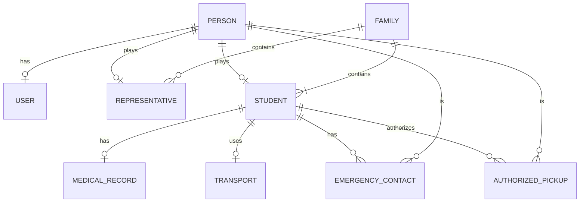
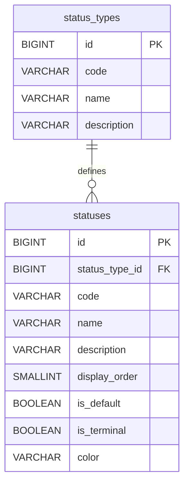
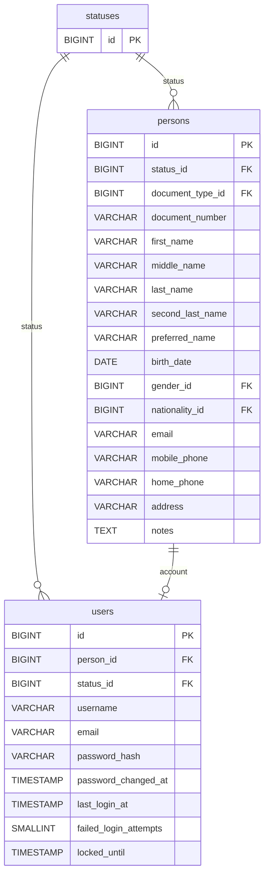
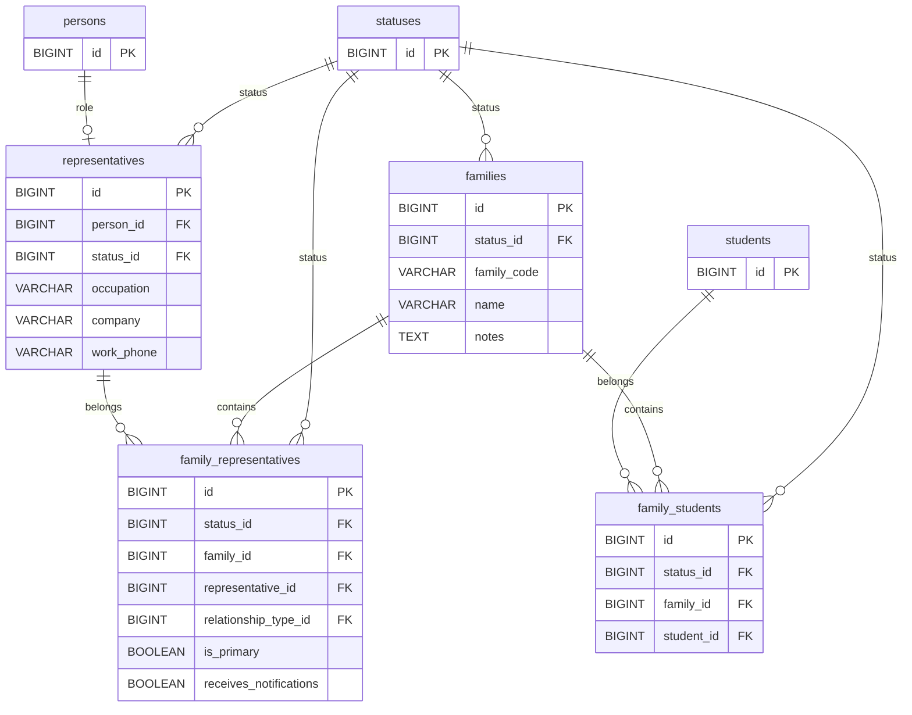
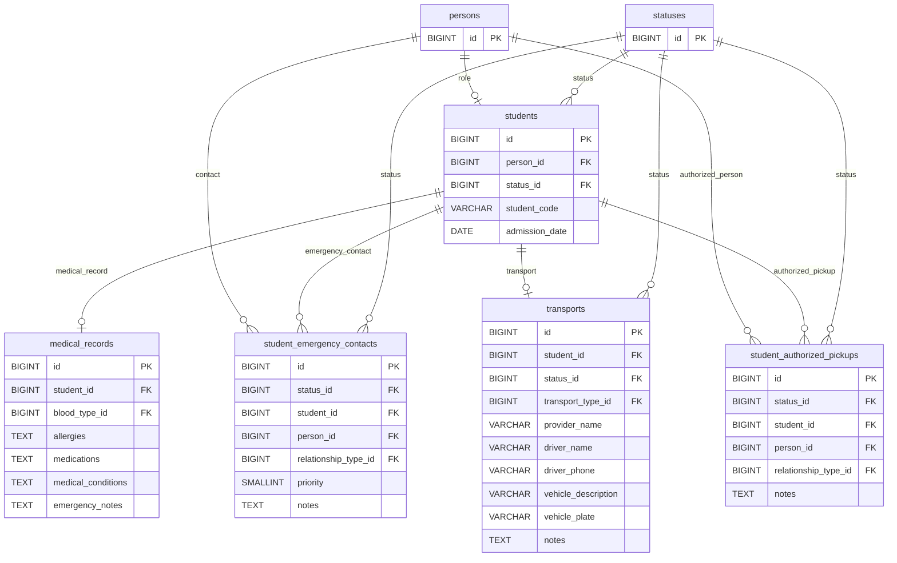

# Entity Relationship Diagram (ERD)

**Versión:** 1.0
**Estado:** En desarrollo
**Última actualización:** Julio 2026

---

# 1. Objetivo

Este documento define la representación gráfica oficial del modelo de datos del Sistema de Información Escolar (SIS).

Su propósito es proporcionar una visión clara, consistente y mantenible de la estructura relacional del sistema, facilitando la comprensión de las entidades, sus atributos principales, las claves primarias y foráneas, así como las relaciones existentes entre ellas.

El ERD constituye el complemento visual del modelo físico definido en `DATABASE_DESIGN.md`.

No sustituye dicho documento ni redefine el modelo de datos.

---

# 2. Objetivos

El Entity Relationship Diagram tiene los siguientes objetivos:

- representar gráficamente el modelo físico del sistema;
- facilitar la comprensión de las relaciones entre entidades;
- servir como referencia para desarrolladores y arquitectos;
- apoyar la implementación mediante GitHub Copilot Agent;
- facilitar revisiones arquitectónicas;
- detectar inconsistencias estructurales;
- servir como apoyo durante la evolución del sistema.

---

# 3. Alcance

Este documento representa exclusivamente el modelo físico aprobado para el sistema.

Incluye:

- entidades persistentes;
- claves primarias;
- claves foráneas;
- atributos funcionales relevantes;
- relaciones;
- cardinalidades.

No incluye:

- reglas de negocio;
- validaciones;
- restricciones funcionales;
- índices;
- tipos de datos;
- convenciones de nombres;
- detalles de auditoría;
- decisiones de implementación.

Toda esta información pertenece a `DATABASE_DESIGN.md`.

---

# 4. Jerarquía Documental

La documentación del proyecto mantiene la siguiente jerarquía:

```text
README
│
├── PROJECT_CONTEXT
│
├── ARCHITECTURE
│
│   ├── DOMAIN_MODEL
│   ├── DATABASE_DESIGN
│   ├── ERD
│   ├── CATALOGS
│   └── SECURITY_GUIDELINES
│
├── CODING_STANDARDS
├── DECISIONS
├── ROADMAP
└── PROMPT_TEMPLATE
```

Cada documento posee una responsabilidad claramente definida.

El ERD depende directamente de `DATABASE_DESIGN.md`.

---

# 5. Fuente Oficial del Modelo

La definición oficial del modelo físico reside exclusivamente en `DATABASE_DESIGN.md`.

Este documento constituye únicamente su representación gráfica.

Ante cualquier discrepancia entre ambos documentos, prevalecerá siempre `DATABASE_DESIGN.md`.

Toda modificación al modelo físico deberá realizarse primero en `DATABASE_DESIGN.md` y posteriormente reflejarse en este documento.

---

# 6. Convenciones

Los diagramas utilizan las siguientes convenciones:

- una caja representa una tabla;
- el primer atributo corresponde a la clave primaria;
- los atributos marcados como FK representan claves foráneas;
- únicamente se muestran los atributos funcionales relevantes;
- los campos estándar de auditoría y Soft Delete se omiten para mejorar la legibilidad del diagrama;
- las cardinalidades representan relaciones físicas implementadas mediante claves foráneas.

---

# 7. Organización del ERD

El modelo se encuentra dividido por dominios funcionales para facilitar su lectura y mantenimiento.

Los diagramas se presentan en el siguiente orden:

1. Catálogos Base
2. Identity
3. Family
4. Student Profile

Cada dominio muestra únicamente las tablas necesarias para comprender sus relaciones.

Las tablas compartidas entre dominios se representan únicamente cuando son necesarias para mantener la continuidad visual del modelo.

---

# 8. Principios de Representación

Los diagramas de este documento siguen los siguientes principios:

- fidelidad absoluta respecto al modelo físico;
- ausencia de duplicidad conceptual;
- claridad visual;
- separación por dominios;
- consistencia entre diagramas;
- trazabilidad con `DATABASE_DESIGN.md`;
- facilidad de mantenimiento.

El objetivo del ERD es facilitar la comprensión del modelo, no reemplazar la documentación detallada de las tablas.

---

# 9. ERD Conceptual

## Objetivo

El siguiente diagrama presenta una vista conceptual del dominio.

Su propósito es mostrar las entidades principales y sus relaciones de negocio sin incorporar detalles propios del modelo físico.



---

## Interpretación

El modelo conceptual refleja los principios fundamentales del dominio:

- Person constituye la identidad única del sistema.
- Los Business Roles evolucionan independientemente de la identidad.
- Family actúa como Aggregate Root para la gestión familiar.
- Student concentra la información específica del estudiante.
- La información médica, transporte, contactos de emergencia y personas autorizadas forman parte del perfil del estudiante.
- Las relaciones familiares se implementan mediante entidades asociativas.

---

## Invariantes del Dominio

El modelo conceptual responde a las siguientes reglas de negocio:

- Toda Person posee una única identidad.
- Una Person puede asumir múltiples Business Roles.
- Un User siempre pertenece a una Person.
- Una Family debe poseer al menos un Representative activo.
- Todo Student debe pertenecer al menos a una Family.
- Cada Student posee como máximo un Medical Record vigente.
- Cada Student posee como máximo un registro de Transport vigente.

---

# 10. ERD Físico

## Objetivo

Los siguientes diagramas representan el modelo físico oficial definido en `DATABASE_DESIGN.md`.

Cada diagrama refleja:

- tablas;
- atributos funcionales relevantes;
- claves primarias;
- claves foráneas;
- relaciones físicas;
- cardinalidades.

No representan restricciones, índices, tipos de datos ni campos estándar de auditoría, los cuales permanecen documentados en `DATABASE_DESIGN.md`.

## Leyenda

Los diagramas físicos utilizan las siguientes convenciones:

- **PK**: Primary Key.
- **FK**: Foreign Key.
- Solo se representan los atributos funcionales relevantes para comprender la estructura del modelo.
- Los campos estándar de auditoría (`created_at`, `updated_at`, `deleted_at`, `created_by`, `updated_by`, `deleted_by`) y los campos de Soft Delete se omiten para mejorar la legibilidad.
- Las relaciones mostradas corresponden exclusivamente a claves foráneas implementadas en el modelo físico.

---

# 11. Catálogos Base



---

# 12. Identity



---

## Observaciones

- `persons` constituye la única fuente de identidad del sistema.
- `users` implementa exclusivamente la autenticación y autorización.
- Una `Person` puede existir sin una cuenta de usuario.
- Un `User` nunca puede existir sin una `Person`.
- Ninguna otra tabla almacena información personal.

---

# 13. Family



---

## Observaciones

- `families` actúa como Aggregate Root del contexto familiar.
- La composición de una familia se administra exclusivamente mediante las tablas relacionales.
- Una familia puede tener múltiples representantes.
- Un representante puede pertenecer a múltiples familias.
- Un estudiante puede pertenecer a múltiples familias según las reglas del dominio.
- No existen relaciones directas entre `families` y `students` ni entre `families` y `representatives`.

# 14. Student Profile



---

## Observaciones

- `students` implementa exclusivamente el Business Role de estudiante.
- Toda la información personal permanece en `persons`.
- Cada estudiante puede tener un único expediente médico vigente.
- Cada estudiante puede tener un único registro de transporte vigente.
- Los contactos de emergencia y las personas autorizadas hacen referencia a una `Person`, independientemente de que sea o no representante del estudiante.
- El detalle operativo del transporte será implementado en módulos posteriores.

---

# 15. Vista General del Modelo Físico

La organización física del modelo del MVP se encuentra estructurada en cuatro dominios:

## Catálogos Base

- status_types
- statuses

## Identity

- persons
- users

## Family

- families
- representatives
- family_representatives
- family_students

## Student Profile

- students
- medical_records
- student_emergency_contacts
- student_authorized_pickups
- transports

---

## Relaciones Principales

```text
status_types
        │
        ▼
statuses
        │
        ├──────────────► persons
        ├──────────────► users
        ├──────────────► families
        ├──────────────► representatives
        ├──────────────► students
        ├──────────────► family_representatives
        ├──────────────► family_students
        ├──────────────► student_emergency_contacts
        ├──────────────► student_authorized_pickups
        └──────────────► transports

persons
    ├────────► users
    ├────────► representatives
    ├────────► students
    ├────────► student_emergency_contacts
    └────────► student_authorized_pickups

families
    ├────────► family_representatives
    └────────► family_students

representatives
    └────────► family_representatives

students
    ├────────► family_students
    ├────────► medical_records
    ├────────► student_emergency_contacts
    ├────────► student_authorized_pickups
    └────────► transports
```

# 16. Validación Arquitectónica

El presente ERD ha sido construido a partir del modelo físico definido en `DATABASE_DESIGN.md` y mantiene consistencia con el modelo de dominio documentado en `DOMAIN_MODEL.md`.

Su finalidad es representar gráficamente el esquema relacional aprobado para el proyecto, sin introducir nuevas decisiones de diseño.

---

## Trazabilidad con DOMAIN_MODEL.md

| Concepto del Dominio | Representación Física |
|----------------------|-----------------------|
| Person | persons |
| User | users |
| Family | families |
| Representative | representatives |
| Student | students |
| Medical Record | medical_records |
| Transport | transports |
| Emergency Contact | student_emergency_contacts |
| Authorized Pickup | student_authorized_pickups |

Los Business Roles continúan implementándose mediante tablas independientes que referencian a `persons`, preservando el principio de identidad única del dominio.

---

## Trazabilidad con DATABASE_DESIGN.md

El ERD representa las decisiones arquitectónicas documentadas en el modelo físico:

- una tabla por entidad;
- una tabla por Business Role;
- claves primarias sustitutas;
- relaciones implementadas mediante claves foráneas;
- uso de `status_id` para entidades con ciclo de vida;
- separación por dominios funcionales;
- ausencia de duplicación de información personal.

Las restricciones, índices, tipos de datos y reglas de auditoría permanecen documentadas exclusivamente en `DATABASE_DESIGN.md`.

---

## Correspondencia de Dominios

| Dominio | Tablas |
|---------|--------|
| Catálogos Base | status_types, statuses |
| Identity | persons, users |
| Family | families, representatives, family_representatives, family_students |
| Student Profile | students, medical_records, student_emergency_contacts, student_authorized_pickups, transports |

---

## Reglas de Sincronización

Siempre que el modelo físico cambie deberá seguirse el siguiente orden:

1. Actualizar `DOMAIN_MODEL.md` cuando el cambio afecte al dominio.
2. Actualizar `DATABASE_DESIGN.md`.
3. Actualizar este documento (`ERD.md`).
4. Actualizar el código de implementación.
5. Actualizar las migraciones correspondientes.
6. Actualizar cualquier otra documentación afectada.

El ERD nunca deberá modificarse de manera independiente del modelo físico.

---

## Lista de Verificación

Antes de considerar actualizado este documento deberá verificarse que:

- todas las tablas del módulo estén representadas;
- todas las claves primarias estén identificadas;
- todas las claves foráneas estén representadas;
- todas las relaciones coincidan con el modelo físico;
- las cardinalidades sean correctas;
- no existan entidades duplicadas;
- no existan relaciones inexistentes en la base de datos;
- los nombres coincidan con `DATABASE_DESIGN.md`;
- el modelo permanezca consistente con `DOMAIN_MODEL.md`.

---

# 17. Evolución del Documento

Este documento evolucionará conforme se incorporen nuevos módulos al sistema.

Cada nuevo módulo deberá agregar sus diagramas respetando la organización por dominios funcionales establecida en este documento.

Cada nuevo dominio funcional deberá:

1. Incorporar un nuevo diagrama físico independiente.
2. Modificar diagramas existentes únicamente cuando se introduzcan nuevas relaciones entre dominios.
3. Mantener la organización funcional establecida en este documento.
4. Reflejar exclusivamente cambios previamente aprobados en `DATABASE_DESIGN.md`.

La incorporación de nuevas entidades deberá mantener los siguientes principios:

- consistencia con el modelo de dominio;
- consistencia con el diseño físico;
- ausencia de duplicación de entidades;
- separación clara entre dominios;
- legibilidad de los diagramas;
- trazabilidad con el resto de la documentación del proyecto.

El objetivo permanente de este documento es constituir la representación gráfica oficial del modelo físico del Sistema de Información Escolar (SIS).
