# ERD

**Versión:** Rebuild 1.0  
**Estado:** Borrador de reconstrucción documental  
**Última actualización:** 2026-07-30

## Propósito
Representación física del diseño definido en DATABASE_DESIGN. Las cardinalidades y nombres deben mantenerse sincronizados con ese documento.

## Diagrama

```mermaid
erDiagram
    status_types {
        BIGINT id PK
        BIGINT status_id FK
    }
    statuses {
        BIGINT id PK
        BIGINT status_id FK
    }
    document_types {
        BIGINT id PK
        BIGINT status_id FK
    }
    sexes {
        BIGINT id PK
        BIGINT status_id FK
    }
    marital_statuses {
        BIGINT id PK
        BIGINT status_id FK
    }
    education_levels {
        BIGINT id PK
        BIGINT status_id FK
    }
    relationship_types {
        BIGINT id PK
        BIGINT status_id FK
    }
    provinces {
        BIGINT id PK
        BIGINT status_id FK
    }
    cantons {
        BIGINT id PK
        BIGINT status_id FK
    }
    parishes {
        BIGINT id PK
        BIGINT status_id FK
    }
    grades {
        BIGINT id PK
        BIGINT status_id FK
    }
    sections {
        BIGINT id PK
        BIGINT status_id FK
    }
    academic_periods {
        BIGINT id PK
        BIGINT status_id FK
    }
    persons {
        BIGINT id PK
        BIGINT status_id FK
    }
    users {
        BIGINT id PK
        BIGINT status_id FK
    }
    representatives {
        BIGINT id PK
        BIGINT status_id FK
    }
    students {
        BIGINT id PK
        BIGINT status_id FK
    }
    families {
        BIGINT id PK
        BIGINT status_id FK
    }
    family_representatives {
        BIGINT id PK
        BIGINT status_id FK
    }
    family_students {
        BIGINT id PK
        BIGINT status_id FK
    }
    family_addresses {
        BIGINT id PK
        BIGINT status_id FK
    }
    representative_address_assignments {
        BIGINT id PK
        BIGINT status_id FK
    }
    student_address_assignments {
        BIGINT id PK
        BIGINT status_id FK
    }
    family_emergency_contacts {
        BIGINT id PK
        BIGINT status_id FK
    }
    emergency_contact_assignments {
        BIGINT id PK
        BIGINT status_id FK
    }
    family_authorized_pickups {
        BIGINT id PK
        BIGINT status_id FK
    }
    authorized_pickup_assignments {
        BIGINT id PK
        BIGINT status_id FK
    }
    institutional_documents {
        BIGINT id PK
        BIGINT status_id FK
    }
    institutional_document_versions {
        BIGINT id PK
        BIGINT status_id FK
    }
    document_requirements {
        BIGINT id PK
        BIGINT status_id FK
    }
    enrollments {
        BIGINT id PK
        BIGINT status_id FK
        BIGINT student_id FK
        BIGINT family_id FK
        BIGINT academic_period_id FK
        BIGINT grade_id FK
        BIGINT section_id FK
        VARCHAR billing_address
        BOOLEAN has_medical_condition
        BOOLEAN requires_institutional_transport
    }
    enrollment_document_acceptances {
        BIGINT id PK
        BIGINT status_id FK
    }
    enrollment_submission_snapshots {
        BIGINT id PK
        BIGINT status_id FK
    }
    snapshot_addresses {
        BIGINT id PK
        BIGINT status_id FK
    }
    snapshot_emergency_contacts {
        BIGINT id PK
        BIGINT status_id FK
    }
    snapshot_authorized_pickups {
        BIGINT id PK
        BIGINT status_id FK
    }
    status_types ||--o{ statuses : classifies
    provinces ||--o{ cantons : contains
    cantons ||--o{ parishes : contains
    document_types ||--o{ persons : identifies
    sexes ||--o{ persons : classifies
    marital_statuses ||--o{ persons : classifies
    education_levels ||--o{ persons : classifies
    persons ||--o| users : owns
    persons ||--o| representatives : role
    persons ||--o| students : role
    families ||--o{ family_representatives : has
    representatives ||--o{ family_representatives : member
    relationship_types ||--o{ family_representatives : describes
    families ||--o{ family_students : has
    students ||--o{ family_students : member
    families ||--o{ family_addresses : owns
    provinces ||--o{ family_addresses : locates
    cantons ||--o{ family_addresses : locates
    parishes ||--o{ family_addresses : locates
    families ||--o{ representative_address_assignments : owns
    representatives ||--o{ representative_address_assignments : assigned
    family_addresses ||--o{ representative_address_assignments : selected
    families ||--o{ student_address_assignments : owns
    students ||--o{ student_address_assignments : assigned
    family_addresses ||--o{ student_address_assignments : selected
    families ||--o{ family_emergency_contacts : owns
    families ||--o{ emergency_contact_assignments : owns
    family_emergency_contacts ||--o{ emergency_contact_assignments : assigned
    students ||--o{ emergency_contact_assignments : protected
    families ||--o{ family_authorized_pickups : owns
    families ||--o{ authorized_pickup_assignments : owns
    family_authorized_pickups ||--o{ authorized_pickup_assignments : assigned
    students ||--o{ authorized_pickup_assignments : protected
    institutional_documents ||--o{ institutional_document_versions : versions
    institutional_document_versions ||--o{ document_requirements : required
    academic_periods ||--o{ document_requirements : applies
    students ||--o{ enrollments : annual
    families ||--o{ enrollments : context
    academic_periods ||--o{ enrollments : period
    grades ||--o{ enrollments : placement
    sections ||--o{ enrollments : placement
    enrollments ||--o{ enrollment_document_acceptances : accepts
    institutional_document_versions ||--o{ enrollment_document_acceptances : accepted
    representatives ||--o{ enrollment_document_acceptances : accepts
    enrollments ||--o| enrollment_submission_snapshots : snapshot
    representatives ||--o{ enrollment_submission_snapshots : submits
    enrollment_submission_snapshots ||--o{ snapshot_addresses : contains
    enrollment_submission_snapshots ||--o{ snapshot_emergency_contacts : contains
    enrollment_submission_snapshots ||--o{ snapshot_authorized_pickups : contains
```

## Reglas de lectura
- persons es la identidad institucional; users es opcional por Person.
- Family conserva membresías y recursos; Student tiene una sola relación Family activa protegida por DATABASE_DESIGN.
- Enrollment representa una sola matrícula por Student y AcademicPeriod; billing_address pertenece a Enrollment y no se relaciona con family_addresses.
- Los hijos snapshot dependen de enrollment_submission_snapshots y conservan únicamente recursos enviados.
- Los estados vigentes de Enrollment son Draft, Submitted, Completed y Cancelled mediante el catálogo central.