# ERD — Enrollment clean rebuild

## Propósito y fuente
Representación visual exacta de `12.DATABASE_DESIGN.md` para MySQL 8. Muestra atributos funcionales, PK/FK y columnas generadas relevantes; auditoría se omite para legibilidad.

```mermaid
erDiagram
    persons { BIGINT id PK BIGINT document_type_id FK VARCHAR document_number VARCHAR first_name VARCHAR middle_name VARCHAR first_surname VARCHAR second_surname DATE birth_date BIGINT sex_id FK BIGINT marital_status_id FK BIGINT education_level_id FK VARCHAR email VARCHAR mobile_phone BIGINT status_id FK VARCHAR active_identification_key }
    users { BIGINT id PK BIGINT person_id FK VARCHAR username BIGINT status_id FK VARCHAR active_person_key }
    representatives { BIGINT id PK BIGINT person_id FK VARCHAR occupation VARCHAR company VARCHAR position BIGINT status_id FK VARCHAR active_person_key }
    students { BIGINT id PK BIGINT person_id FK VARCHAR institutional_code DATE admission_date BIGINT status_id FK VARCHAR active_person_key }
    families { BIGINT id PK VARCHAR display_name BIGINT status_id FK }
    family_representatives { BIGINT id PK BIGINT family_id FK BIGINT representative_id FK BIGINT relationship_type_id FK BOOLEAN is_primary BIGINT status_id FK VARCHAR active_family_representative_key BIGINT active_primary_family_key }
    family_students { BIGINT id PK BIGINT family_id FK BIGINT student_id FK TIMESTAMP started_at TIMESTAMP ended_at BIGINT status_id FK BIGINT active_student_id }
    family_addresses { BIGINT id PK BIGINT family_id FK VARCHAR label BIGINT province_id FK BIGINT canton_id FK BIGINT parish_id FK VARCHAR main_street BIGINT status_id FK VARCHAR active_family_label_key }
    representative_address_assignments { BIGINT id PK BIGINT family_address_id FK BIGINT family_id FK BIGINT representative_id FK TIMESTAMP ended_at VARCHAR active_family_representative_key }
    student_address_assignments { BIGINT id PK BIGINT family_address_id FK BIGINT family_id FK BIGINT student_id FK TIMESTAMP ended_at VARCHAR active_family_student_key }
    family_emergency_contacts { BIGINT id PK BIGINT family_id FK VARCHAR names BIGINT relationship_type_id FK VARCHAR mobile_phone BIGINT status_id FK }
    emergency_contact_assignments { BIGINT id PK BIGINT family_emergency_contact_id FK BIGINT student_id FK BIGINT status_id FK VARCHAR active_contact_student_key }
    family_authorized_pickups { BIGINT id PK BIGINT family_id FK VARCHAR names BIGINT relationship_type_id FK VARCHAR document_number BIGINT status_id FK }
    authorized_pickup_assignments { BIGINT id PK BIGINT family_authorized_pickup_id FK BIGINT student_id FK BIGINT status_id FK VARCHAR active_pickup_student_key }
    enrollments { BIGINT id PK BIGINT student_id FK BIGINT family_id FK BIGINT academic_period_id FK BIGINT grade_id FK BIGINT section_id FK BOOLEAN requires_institutional_transport BOOLEAN is_authorized_to_leave_alone BIGINT status_id FK VARCHAR active_student_period_key }
    institutional_documents { BIGINT id PK VARCHAR name BIGINT status_id FK }
    institutional_document_versions { BIGINT id PK BIGINT institutional_document_id FK VARCHAR version BIGINT status_id FK VARCHAR active_document_version_key }
    document_requirements { BIGINT id PK BIGINT institutional_document_version_id FK BIGINT academic_period_id FK BOOLEAN is_required VARCHAR active_requirement_key }
    document_acceptances { BIGINT id PK BIGINT enrollment_id FK BIGINT institutional_document_version_id FK BIGINT accepted_by_representative_id FK VARCHAR active_acceptance_key }
    enrollment_submission_snapshots { BIGINT id PK BIGINT enrollment_id FK BIGINT submitted_by_representative_id FK VARCHAR active_enrollment_key }
    submitted_address_snapshots { BIGINT id PK BIGINT enrollment_submission_snapshot_id FK VARCHAR label VARCHAR main_street }
    submitted_emergency_contact_snapshots { BIGINT id PK BIGINT enrollment_submission_snapshot_id FK VARCHAR names VARCHAR mobile_phone }
    submitted_authorized_pickup_snapshots { BIGINT id PK BIGINT enrollment_submission_snapshot_id FK VARCHAR names VARCHAR document_number }
    document_types { BIGINT id PK VARCHAR code }
    sexes { BIGINT id PK VARCHAR code }
    marital_statuses { BIGINT id PK VARCHAR code }
    education_levels { BIGINT id PK VARCHAR code }
    relationship_types { BIGINT id PK VARCHAR code }
    provinces { BIGINT id PK VARCHAR code }
    cantons { BIGINT id PK BIGINT province_id FK VARCHAR code }
    parishes { BIGINT id PK BIGINT canton_id FK VARCHAR code }
    grades { BIGINT id PK VARCHAR code }
    sections { BIGINT id PK VARCHAR code }
    academic_periods { BIGINT id PK VARCHAR code }
    statuses { BIGINT id PK VARCHAR code }
    persons ||--o| users : account
    persons ||--o| representatives : role
    persons ||--o| students : role
    families ||--o{ family_representatives : has
    representatives ||--o{ family_representatives : joins
    families ||--o{ family_students : has
    students ||--o{ family_students : membership
    families ||--o{ family_addresses : owns
    family_addresses ||--o{ representative_address_assignments : assigned
    families ||--o{ representative_address_assignments : context
    representatives ||--o{ representative_address_assignments : receives
    family_addresses ||--o{ student_address_assignments : assigned
    families ||--o{ student_address_assignments : context
    students ||--o{ student_address_assignments : receives
    families ||--o{ family_emergency_contacts : owns
    family_emergency_contacts ||--o{ emergency_contact_assignments : assigns
    students ||--o{ emergency_contact_assignments : receives
    families ||--o{ family_authorized_pickups : owns
    family_authorized_pickups ||--o{ authorized_pickup_assignments : assigns
    students ||--o{ authorized_pickup_assignments : receives
    students ||--o{ enrollments : annual
    families ||--o{ enrollments : context
    academic_periods ||--o{ enrollments : period
    grades ||--o{ enrollments : placement
    sections ||--o{ enrollments : placement
    institutional_documents ||--o{ institutional_document_versions : versions
    institutional_document_versions ||--o{ document_requirements : required
    academic_periods ||--o{ document_requirements : applies
    enrollments ||--o{ document_acceptances : accepts
    institutional_document_versions ||--o{ document_acceptances : version
    representatives ||--o{ document_acceptances : accepts
    enrollments ||--o| enrollment_submission_snapshots : snapshot
    representatives ||--o{ enrollment_submission_snapshots : submits
    enrollment_submission_snapshots ||--o{ submitted_address_snapshots : captures
    enrollment_submission_snapshots ||--o{ submitted_emergency_contact_snapshots : captures
    enrollment_submission_snapshots ||--o{ submitted_authorized_pickup_snapshots : captures
    provinces ||--o{ cantons : contains
    cantons ||--o{ parishes : contains
```

## Invariantes no visuales
FamilyStudents tiene una sola membresía activa por Student mediante `active_student_id`. Las asignaciones de dirección validan coincidencia de Family transaccionalmente. Las claves `active_*` son columnas generadas MySQL 8 y garantizan unicidad activa. Enrollment es único por Student/AcademicPeriod y snapshot único por Enrollment.
